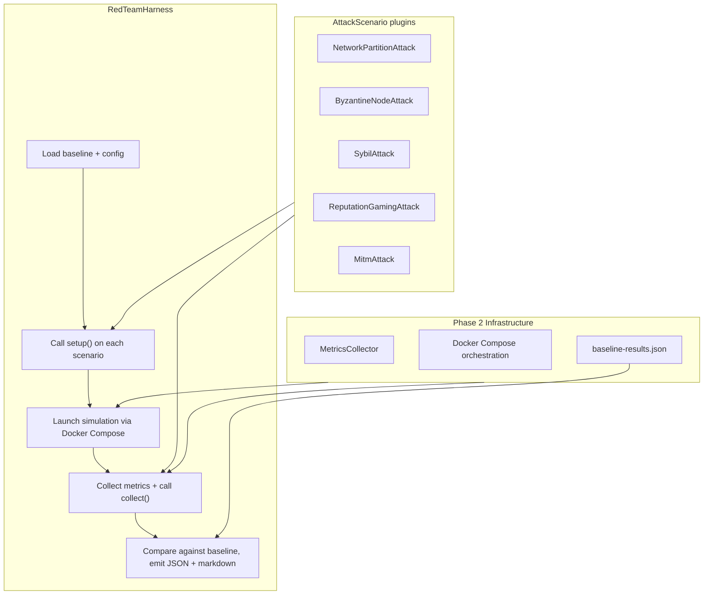
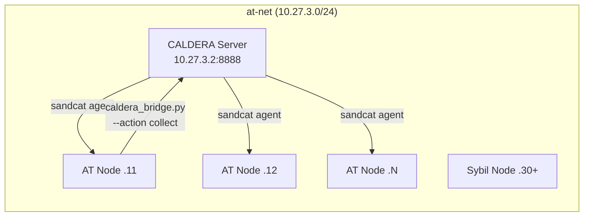

[< Integration Testing](integration-testing.md)

# Adversarial Testing

The adversarial testing framework validates the security claims of the AutonomousTrust protocol stack through five automated attack scenarios. Each scenario targets a specific vulnerability class (Sybil resistance, Byzantine fault tolerance, network partition recovery, reputation gaming resilience, and encryption integrity) and measures the protocol's response against a Phase 2 baseline collected from the Appalachian mesh simulation.

The framework is structured in two layers: a standalone Python layer that requires no external dependencies, and an optional CALDERA orchestration layer that adds MITRE ATT&CK-aligned scheduling and reporting.

## Architecture

The red team package (`simulator/redteam/`) provides a plugin interface, a modified router for partition injection, and a harness that orchestrates the full attack cycle.

## AttackScenario interface

Each attack implements the `AttackScenario` base class with three methods:

- **setup(sim_config, compose_config)** modifies simulation and Docker Compose configuration before containers launch. This is where routers are swapped, processes are replaced, and sidecar containers are injected.
- **teardown()** cleans up after the simulation ends or on failure. Called in a `finally` block by the harness.
- **collect(metrics)** adds attack-specific measurements to the metrics report after the simulation completes.

The original design considered a per-timestep `execute()` callback, but none of the five attacks require runtime intervention. The AttackRouter handles partition timing internally, and the remaining attacks are fully configured at setup time.

## AttackRouter

`AttackRouter` extends the base `Router` from the radio layer. The parent router manages iptables rules each timestep based on the terrain connectivity matrix. AttackRouter calls `super().recv_data()` first to apply normal connectivity, then re-injects DROP rules for any active partitions. This ordering ensures partition isolation overrides connectivity even when the parent has just allowed a link.

Partitions are defined as `PartitionEvent` dataclasses specifying a time window and two groups of peer IDs. The router checks the partition schedule on each timestep and activates or deactivates iptables DROP rules bidirectionally between the groups. The `finish()` override clears all partition rules before parent teardown.

## Attack scenarios

| Scenario | Mechanism | Target Vulnerability | Expected AT Response |
|----------|-----------|---------------------|---------------------|
| **Network Partition** | AttackRouter injects iptables DROP rules between peer groups on a timed schedule | No explicit partition recovery in the protocol | Store-and-forward recovery; state re-converges after partition heals |
| **Byzantine Node** | Modified `ReputationProcess` sends inconsistent `TransactionScore` values to different peers | Paxos prepare quorum at `>= n/2` and accept quorum at `> n/2` instead of Byzantine threshold `> 2n/3`; unverified NaCl signatures on proposals | Consensus detects inconsistency; byzantine node reputation drops below trust threshold |
| **Sybil** | Extra Docker containers with fabricated NaCl keypairs attempt identity voting admission | Identity voting must reject unknown keys | Voting rejects fake identities; identity count stays bounded |
| **Reputation Gaming** | Normal AT process cooperates to build trust, then defects at a configured time | Accumulated trust from cooperation phase | Tit-for-tat recovery; reputation penalty exceeds the trust gained before defection |
| **MITM** | tcpdump sidecar captures traffic between two nodes; pcap is analyzed for plaintext protocol strings and replayed packets | NaCl encryption must prevent content extraction and nonce reuse | Encryption holds; no plaintext leaked; replayed packets rejected |

The Byzantine attack exploits two distinct quorum thresholds in the current Paxos implementation. The prepare phase requires `>= len(peers) // 2` grants, and the accept phase requires `> len(peers) // 2` acceptances. Neither meets the `> 2*peers/3` threshold required for Byzantine fault tolerance. A single Byzantine node in a group of three can break consensus at the prepare phase.

The MITM analysis searches captured bytes for known AT message signatures: process names and function identifiers registered via `Protocol.register_handler()` (such as `'ask permission'` and `'transaction'`). It also attempts replay of captured packets to verify nonce-based rejection.

## Harness orchestration

The harness accepts a list of `AttackScenario` instances and a base Appalachian scenario configuration. It loads the Phase 2 baseline from `baseline-results.json`, calls `setup()` on each scenario to modify the configuration, launches the simulation, collects metrics, calls `collect()` for attack-specific results, and compares post-attack metrics against the baseline. Output is a consolidated JSON report with per-attack results (`PASS`, `FAIL`, `ERROR`, or `NO_DATA`) and a human-readable markdown summary.

A configurable wall-clock timeout (default: `--quick` duration plus 60 seconds grace) guards against hangs. If the simulation exits non-zero, the harness collects partial metrics and marks the attack as `ERROR`. If metrics collection fails entirely, container logs are attached under `NO_DATA`.

## CALDERA orchestration (optional)

MITRE CALDERA provides an optional scheduling and reporting layer. When enabled via the `--caldera` flag, it runs alongside the AT containers on the same Docker bridge network without replacing any attack logic.

The key design constraint is that `AttackScenario.setup()` methods modify compose and simulation configuration **before** containers launch, while CALDERA abilities run **after** containers are up. Therefore all attack pre-configuration is baked into the Docker Compose YAML at generation time by `caldera_compose.patch_caldera()`. CALDERA abilities only invoke `collect()`: they gather attack-specific metrics from running containers via a CLI bridge (`caldera_bridge.py`). The bridge is a thin read-only dispatcher: it instantiates the appropriate `AttackScenario`, calls `collect()`, and prints JSON to stdout.

Only three attacks are CALDERA-orchestrated (Sybil, Byzantine, reputation gaming). The network partition attack operates at the Router level with no agent needed, and the MITM attack uses its own tcpdump sidecar.

CALDERA failures are non-fatal. If sandcat agents do not register within 60 seconds or if an operation fails, the harness falls back to direct Python `collect()` calls with a warning. Metrics output is identical regardless of whether CALDERA is active.

### IP allocation

| Address | Role |
|---------|------|
| `10.27.3.1` | Router gateway |
| `10.27.3.2` | CALDERA server (reserved) |
| `10.27.3.11+` | AT peer nodes |
| `10.27.3.30+` | Sybil attack nodes |

## Known vulnerabilities targeted

The adversarial framework specifically targets three weaknesses in the current AT implementation:

1. **Insufficient Paxos quorum thresholds.** Both the prepare and accept phases use simple majority voting rather than the `> 2n/3` supermajority required for Byzantine fault tolerance. The Byzantine attack scenario validates whether AT can still detect and penalize inconsistent behavior despite this gap.

2. **Unverified NaCl signatures on Paxos proposals.** Proposal messages in the reputation process do not verify cryptographic signatures before processing. The Byzantine node exploits this to inject conflicting scores without detection at the crypto layer.

3. **No explicit network partition recovery.** The protocol relies on store-and-forward semantics and history synchronization to recover from splits, but has no dedicated partition detection or recovery mechanism. The partition attack measures whether implicit recovery is sufficient.

[Space Communications >](space-communications.md)
