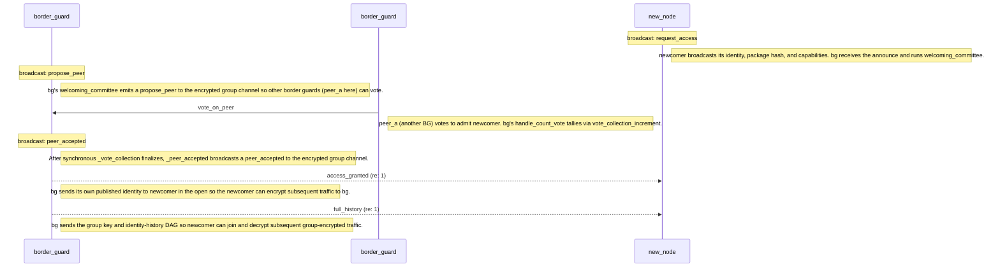

[< Networking](networking.md)

# Identity Protocol

The identity protocol handles peer discovery, group formation, and ongoing admission of new nodes. It is a permissionless consensus protocol that must mitigate Sybil attacks.

## Protocol Messages

| Message | Constant | Payload |
|---------|----------|---------|
| `request_access` | `announce` | `(identity, package_hash, capabilities_list)` |
| `access_granted` | `accept` | `(identity, package_hash, capabilities_list)` |
| `full_history` | `history` | `(list[LinkedStep], Group)` |
| `history_diff` | `diff` | `list[LinkedStep]` |
| `propose_peer` | `propose` | `IdentityObj` |
| `vote_on_peer` | `vote` | `(IdentityObj, AgreementProof, (message_bytes, signature_bytes))` |
| `peer_accepted` | `confirm` | `IdentityObj` |
| `group_key_update` | `update` | `Group` |

## Phases

### Phase 0: Acquire Capabilities

The identity process waits (up to 10 seconds) for other local processes to register their capabilities via the IPC queue. This determines what services this node can offer to the network.

### Phase 1: Announce Identity

The node broadcasts its identity on the **open broadcast channel** (unencrypted UDP broadcast/multicast). The announcement contains the node's published identity (public keys only), package hash (to verify software authenticity), and capability list.

### Phase 2: Choose Group

The node waits to receive `full_history` messages from existing peers. These contain a group key and the identity DAG history. After a timeout period:

- If histories were received, the node selects the one with the longest step list, adopts that group, and sends a `history_diff` on the **encrypted group channel** containing any steps the group doesn't have.
- If no histories were received, the node creates its own group from scratch.

### Phase 3: Border Guard Mode (Concurrent)

Once in a group, the node enters border guard mode and concurrently:

- **Listens** for `request_access` announcements from new nodes on the open channel
- **Proposes** new peers to the group via `propose_peer` on the **encrypted group channel**
- **Votes** on proposed peers and collects votes from others
- **Confirms** accepted peers via `peer_accepted` on the **encrypted group channel**
- **Sends** identity acceptance and history to newly admitted peers on **encrypted peer-to-peer**
- **Handles** history diffs, group updates, and peer confirmations from other group members

## Peer Hierarchy

Peers are organized into 3 levels with a 10-level valuation scale. New peers enter at the middle level. Peers can be demoted for bad behavior (sending invalid messages, persistent failures).

## Identity Protocol Sequence

The diagram below is generated from `conformance/scenarios/identity/identity-canonical.yaml` by `scripts/build-docs.sh` — it cannot drift from the executable corpus.

<!-- at_diagram:start protocol=identity scenario=identity-canonical -->

<!-- at_diagram:end -->

**Channel semantics:** `request_access` travels on the **open broadcast channel** (unencrypted UDP). `propose_peer`, `vote_on_peer`, and `peer_accepted` travel on the **encrypted group channel**. `access_granted` is sent peer-to-peer in the open (the newcomer has no group key yet), and `full_history` is peer-to-peer encrypted with the leader's box key once `access_granted` has been processed.

**Internal steps not on the wire** (omitted from the diagram, but part of the protocol):

- After receiving `propose_peer`, each receiver runs `_process_id()` to verify the candidate's UUID and keys don't collide with existing peers; rejection short-circuits the vote.
- After receiving each `vote_on_peer`, the leader runs `count_vote()` to verify the signature and increment the vote tally.
- After receiving `access_granted`, the newcomer runs `handle_acceptance()` to add the leader as a peer, then `receive_history()` on the subsequent `full_history` to adopt the group key.
- The newcomer's `choose_group()` selects the longest history if multiple groups responded, and sends a `history_diff` back to the group with any steps the group is missing.

**Alternate path — amnesia readmission.** If the leader recognizes the newcomer's UUID from history (a previously-known peer rejoining), it skips the voting round and emits `peer_accepted` / `access_granted` / `full_history` directly. The amnesia trace is pinned by `conformance/scenarios/identity/amnesia-readmission.yaml`. v1 of the diagram tool does not render `alt`/`else` branches; the two paths are documented as separate scenarios.

**Group key rotation.** When the group composition changes, the leader broadcasts `group_key_update` (encrypted peer-to-peer) so existing members rotate to the new key. Covered by `conformance/scenarios/identity/group-key-update.yaml`.

## Agreement Implementations

The voting mechanism is pluggable via `AgreementImpl`:

| Implementation | Class | Description |
|---------------|-------|-------------|
| Proof of Work | `IdentityByWork` | Computational proof required |
| Proof of Stake | `IdentityByStake` | Stake-weighted voting (timeout: 5s) |
| Proof of Authority | `IdentityByAuthority` | Authority-weighted voting (timeout: 5s) |

## Security Properties

- **Package hash verification**: Nodes running different software versions are rejected
- **Duplicate detection**: UUID, signing key, and encryption key collisions are detected and rejected during voting
- **Signature verification**: All votes include Ed25519 signatures verified against the voter's public key
- **Open-channel minimization**: Only `announce` and `accept` use the open channel; `accept` is unencrypted because the new peer doesn't yet have the group key or the leader's public key for Box encryption

[Task Negotiation >](negotiation.md)
