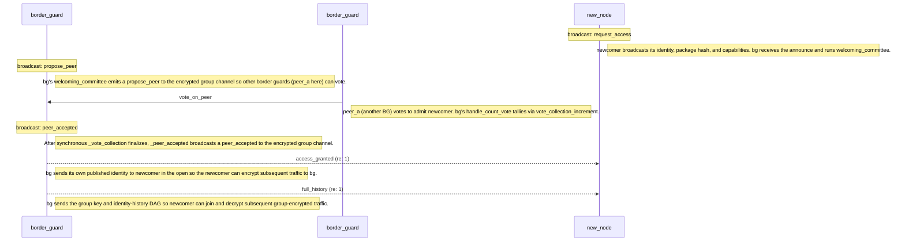

*Previous: [How a node is built](overview.md)*

# Becoming a peer

A node arriving on the network knows nothing and is owed nothing. It has a key
pair it generated itself, a list of what it can do, and no relationship with
anybody. Getting from there to being a member of a working group is the job of
the identity protocol, and it is the one place in the framework where a
permissionless population has to reach a decision.

The difficulty is the one every open network has. Anybody can generate a key
pair, so anybody can generate ten thousand of them, and a protocol that admits
whoever asks admits the ten thousand along with the one honest newcomer. That is
the Sybil attack, and there is no cryptographic answer to it, because every one
of the ten thousand identities is cryptographically impeccable.

The answer here is that admission is not a fact about the newcomer at all. It is
a decision made by the peers who are already in, by vote, on the encrypted
channel the newcomer cannot yet read. A newcomer announces itself in the open,
existing members propose it, existing members vote, and only a majority admits
it. The cost of manufacturing a thousand identities is unchanged; the value of
doing so drops to nothing, because a thousand strangers still get zero votes.

What follows walks that process from the announcement through to full
membership, then covers what a member does afterward, what travels on which
channel, and what the protocol checks along the way.

## The channels

Three channels exist, and knowing which is which explains most of the protocol.

The *open broadcast channel* is unencrypted UDP broadcast or multicast. It
exists because a node that has joined nothing holds no key that anyone else
holds, so its first word has to be spoken in the clear. Exactly two message
types use it.

The *encrypted group channel* carries everything the group says to itself,
encrypted under a shared symmetric key. Proposals, votes, confirmations, and all
consensus traffic travel here, and a non-member hears noise.

The *encrypted peer-to-peer channel* carries traffic between two named peers,
encrypted with the private key of the sender and the public key of the
recipient. Admission hand-offs and history transfers travel here.

## Joining

The protocol runs in numbered phases, and a node walks them in order.

*Phase 0, acquire capabilities.* The identity process waits, up to ten seconds,
for other local processes to register what services this node can offer. This
determines what the node will advertise, and it happens before anything touches
the network, because announcing capabilities the node does not have is the first
way to lose standing.

*Phase 1, announce.* The node broadcasts its identity on the open channel. The
announcement carries its published identity, meaning public keys only, a hash of
the software package it is running, and its capability list.

*Phase 2, choose a group.* The node waits for existing peers to send it group
histories. Each history contains a group key and the identity history structure.
After a timeout, one of two things happens. If histories arrived, the node
selects the one with the longest step list, adopts that group, and sends back
any steps the group is missing. If none arrived, the node concludes it is alone
and creates a group of its own.

*Phase 3, border guard.* Once in a group, the node takes up the duty every
member holds, which is guarding the boundary for everybody else. This phase does
not end.

The protocol messages, for reference:

| Message | Constant | Payload |
|---------|----------|---------|
| `request_access` | `announce` | `(identity, package_hash, capabilities_list)` |
| `access_granted` | `accept` | `(identity, package_hash, capabilities_list)` |
| `full_history` | `history` | `(list[LinkedStep], Group)` |
| `history_diff` | `diff` | `list[LinkedStep]` |
| `propose_peer` | `propose` | `IdentityObj` |
| `vote_on_peer` | `vote` | `(IdentityObj, AgreementProof, (message_bytes, signature_bytes))` |
| `peer_accepted` | `confirm` | `IdentityObj` |
| `group_key_update` | `update` | `Group` |

## Standing border guard

Border guard mode is concurrent rather than sequential, and every member runs
it. A node in this mode listens on the open channel for announcements from
newcomers, proposes them to the group on the encrypted channel, votes on peers
others have proposed, collects the votes, confirms accepted peers, sends
identity acceptance and history to the newly admitted over peer-to-peer
encryption, and handles history differences, group updates, and confirmations
arriving from other members.

Two further mechanisms run alongside it after admission.

The *bootstrap corpus* issues small bilateral capability exchanges shortly after
the first peer joins, being a handshake, a time attestation, and an echo
challenge. Their purpose is not the work itself. It is that a freshly admitted
peer accumulates a real transaction history immediately rather than sitting at
flat neutral reputation waiting for something to happen.

*Capability and identity resync* covers the case where admission succeeded but
some of its state did not arrive. The directed capability query sent at
confirmation time and the announcement broadcast can both be lost, particularly
over a bridged network or with a late joiner. The identity process therefore
runs periodic backstop sweeps, re-querying admitted peers with no registered
capabilities and backfilling missing peer identities for addresses already in
the group.

## The admission sequence

The diagram below is generated from a conformance scenario by the documentation
build, so it cannot drift from the executable corpus.

<!-- at_diagram:start protocol=identity scenario=identity-canonical -->

<!-- at_diagram:end -->

Channel assignment for the sequence above. The `request_access` travels on the
open broadcast channel. The `propose_peer`, `vote_on_peer`, and `peer_accepted`
travel on the encrypted group channel. The `access_granted` is sent peer-to-peer
in the open, because the newcomer holds neither the group key nor the public key
of the leader yet, and the subsequent `full_history` is peer-to-peer encrypted
under the box key of the leader once the acceptance has been processed.

Several steps are part of the protocol and never appear on the wire. After
receiving a proposal, each recipient verifies that the UUID and keys of the
candidate do not collide with an existing peer, and a rejection short-circuits
the vote. After each vote, the leader verifies the signature before incrementing
the tally. After receiving acceptance, the newcomer adds the leader as a peer
and then adopts the group key from the history that follows. And the
group-selection step in the newcomer picks the longest history when several
groups answered, sending back any steps the group turns out to be missing.

Two alternate paths exist. Under *amnesia readmission*, a leader that recognizes
the UUID of the newcomer from history, meaning a previously known peer
rejoining, skips the voting round entirely and emits confirmation, acceptance,
and history directly. Under *group key rotation*, a change in group composition
causes the leader to broadcast a key update peer-to-peer so existing members
rotate to the new key. Both are pinned by their own conformance scenarios.

## What travels, and in what form

Identity and group payloads are serialized in a canonical flat-dictionary JSON
form that the C implementation can parse byte for byte. The default Python
encoder form, carrying type markers and a wrapped seed, is not parseable by the
C side, so every cross-runtime delivery emits the canonical form instead, and
the C twin produces a byte-identical shape.

An identity carries two human-readable names, and the distinction between them
is a Zooko-triangle distinction rather than a convenience. The *nickname* is the
global, self-asserted name, and it is part of the canonical wire form, so a
receiver learns what the peer calls itself. The *petname* is the local name a
node assigns for its own use, it is never serialized or transmitted, and every
receiver assigns its own. A unit test asserts that the canonical set contains
the first and not the second, because a leaked petname would turn a local
convenience into a global namespace, which is exactly what this design refuses.

## What keeps this honest

Four checks carry the security of the protocol, and each closes a specific
attack.

*Package hash verification* rejects nodes running different software, which
prevents a modified implementation from participating on equal terms.

*Duplicate detection* rejects collisions in UUID, signing key, and encryption
key during voting, which is what stops an existing identity from being
impersonated by a newcomer claiming it.

*Signature verification* applies to every vote, checked against the public key
of the voter, so a tally counts signatures rather than assertions.

*Open-channel minimization* confines unencrypted traffic to announcement and
acceptance. Acceptance is unencrypted only because the new peer holds neither
the group key nor the public key of the leader at that instant, which is the
smallest window the protocol can arrange.

The voting mechanism itself is pluggable, and the choice is a deployment
decision rather than a protocol one.

| Implementation | Class | Description |
|---------------|-------|-------------|
| Proof of Work | `IdentityByWork` | Computational proof required |
| Proof of Stake | `IdentityByStake` | Stake-weighted voting, five-second timeout |
| Proof of Authority | `IdentityByAuthority` | Authority-weighted voting, five-second timeout |

Peers are organized into three levels on a ten-level valuation scale, and a new
peer enters at the middle level. Peers can be demoted for bad behavior, meaning
invalid messages or persistent failures. The reputation-derived trust tiers of
the next chapters layer on top of this rather than replacing it.

## Pinned scenarios

| Behavior | Scenario |
|---|---|
| Admission happy path | [`identity-canonical.yaml`](../../src/autonomous-trust/conformance/scenarios/identity/identity-canonical.yaml) |
| Amnesia readmission | [`amnesia-readmission.yaml`](../../src/autonomous-trust/conformance/scenarios/identity/amnesia-readmission.yaml) |
| Group key rotation | [`group-key-update.yaml`](../../src/autonomous-trust/conformance/scenarios/identity/group-key-update.yaml) |

The diagram tool does not render alternate branches, so the readmission path is
kept as a separate scenario rather than folded into the canonical one.

## Further reading

- [Networking](networking.md): the socket layer, the three channels, and message
  routing underneath this protocol.
- [Partition recovery](partition-recovery.md): split-brain detection, the
  probe-and-adopt merge path, and the resync sweeps described above.
- [The dual implementation](native-ffi-dual-implementation.md): cross-runtime
  serialization, including the canonical form.
- [Persistent cohort](persistent-cohort.md): what a node remembers about group
  membership across a restart.

---

*Next: [Getting work done](negotiation.md)*
