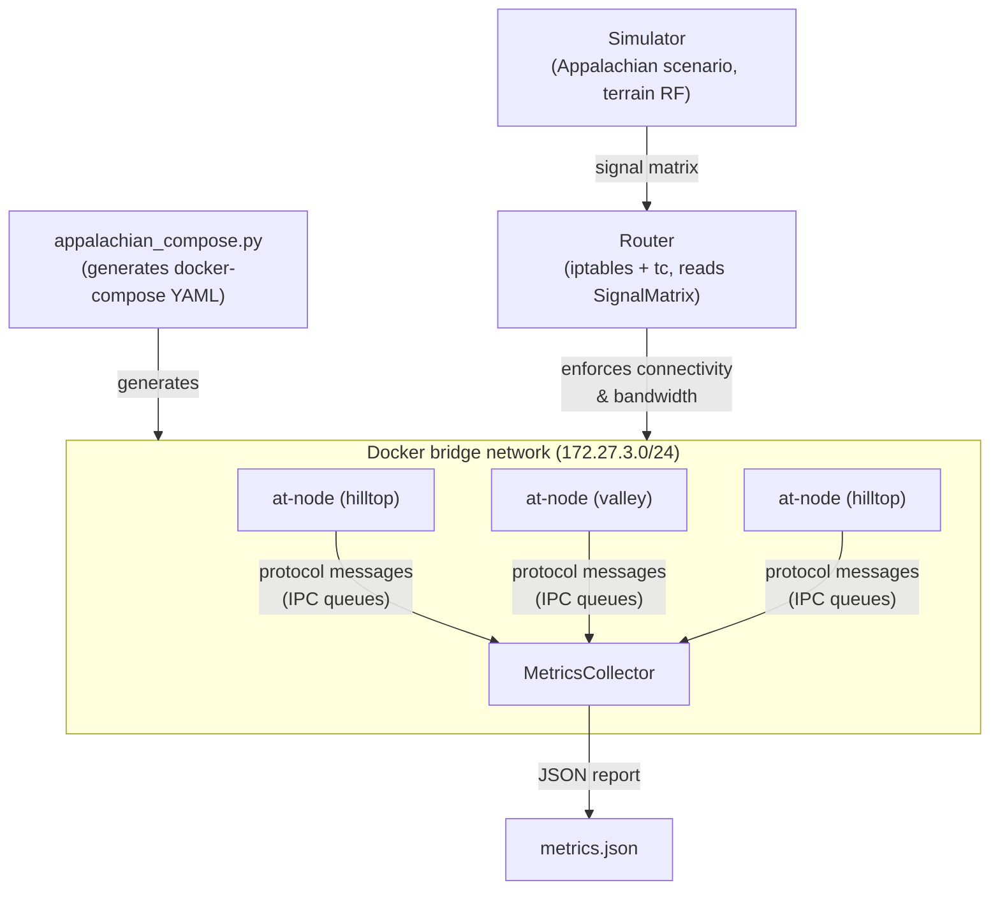

[< Node Lifecycle](node-lifecycle.md)

# Integration Testing Architecture

The simulator's integration testing framework runs real AutonomousTrust processes over terrain-aware simulated networks and measures protocol performance under realistic mesh conditions. An Appalachian mountain scenario serves as the reference topology, with 20 nodes (8 hilltop relays, 12 valley endpoints) deployed across Braxton County, West Virginia.

## Component Overview

| Component | Module | Purpose |
|-----------|--------|---------|
| MetricsCollector | `simulator.metrics.collector` | AT Process that observes protocol events via IPC queues and produces JSON reports |
| Appalachian Compose Generator | `simulator.scenarios.appalachian_compose` | Wraps `gen_compose.py` to map scenario nodes to Docker services with terrain metadata |
| Test Simulation Script | `config/test-simulation.sh` | Orchestrated Docker launch: simulator + compose + metric collection + teardown |

All paths are relative to `src/autonomous-trust-simulator/`.

## MetricsCollector

`MetricsCollector` is an AT `Process` subclass registered via `ProcMeta` (proc_name `metrics-collector`), following the same plugin pattern as `SimMetadataSource`. It receives all broadcast messages through the standard `queues[self.name]` mechanism and requires no changes to core AT processes.

```python
class MetricsCollector(Process, metaclass=ProcMeta,
                       proc_name='metrics-collector',
                       description='Protocol metrics collection'):

    def _handle_identity_event(self, function: str, peer_id: str, timestamp: datetime): ...
    def _handle_reputation_event(self, peer_id: str, score: float): ...
    def _handle_negotiation_event(self, function: str, task_id: str, timestamp: datetime): ...
    def _record_message_bytes(self, nbytes: int): ...
    def report(self) -> dict: ...
```

The collector tracks four metrics derived from protocol message streams:

| Metric | Source Messages | Calculation |
|--------|----------------|-------------|
| Identity convergence | `access_granted` from IdentityProtocol | Time delta from first to last peer admission |
| Reputation stability | `reputation response` from ReputationProtocol | Mean standard deviation of per-peer scores after convergence |
| Negotiation RTT | `invitation` / `haggle` pairs from NegotiationProtocol | Timestamp delta matched by task correlation ID |
| Bandwidth overhead | All `Message` objects + SimState link bandwidth | Protocol bytes / available link capacity per interval |

On shutdown, the collector writes a JSON report to a configurable output path.

## Appalachian Compose Generator

The compose generator wraps `gen_compose.generate_compose()` and patches the output YAML to add scenario-specific metadata. Each Docker service is renamed to its Appalachian node identifier and receives environment variables for coordinates, elevation, antenna tier, and terrain configuration path. Existing properties from `gen_compose` -- IP assignment (`172.27.3.{10+i}`), staggered startup delays, backend selection, and `NET_ADMIN` capability -- are preserved.

```python
def generate_appalachian_compose(
    hilltop_only: bool = False,
    terrain_config: str = None,
    backend: str = "native",
    log_level: str = "info",
) -> str: ...
```

## System Topology



## Verification Strategy

Testing is layered to separate protocol correctness from infrastructure concerns:

- **In-process test** (`tests/test_appalachian_inprocess.py`): Launches AT processes via `multiprocessing.Pool` following the `mock.py` pattern (QueuePool, ProcessTracker, ConfigMap). The simulator computes connectivity from terrain data but no iptables enforcement occurs. Runs in CI without Docker.
- **Docker system test** (`tests/c_system/test_appalachian_scenario.py`): Full Router enforcement with iptables and traffic control. Marked `@pytest.mark.docker`; requires a running Docker daemon and the AT container image.

Both layers assert against the same metric targets.

## Metrics Targets

| Metric | Target | Rationale |
|--------|--------|-----------|
| Identity convergence (20 nodes) | < 60 s | Upper bound for full-mesh admission across terrain-limited links |
| Reputation stability (non-adversarial) | sigma < 0.05 | Scores must converge tightly when no adversary is present |
| Negotiation RTT | Reflects simulated link latency | RTT should track the Router-imposed delay, not be dominated by processing |
| Bandwidth overhead (steady-state) | < 15% | Protocol traffic must leave sufficient capacity for application data |

## Dependencies

- **Phase 1 (Terrain RF Layer)**: Appalachian scenario definition, terrain path-loss model, Router bandwidth shaping from SignalMatrix.
- **Docker daemon**: Required for the system test and the `test-simulation.sh` orchestration script.
- **conda environment** (`muudd_simulation`): All AT packages installed.

## Integration Points

- MetricsCollector plugs into the process system via `ProcMeta`, identical to any other AT subsystem. It is listed as optional in `subsystems.cfg.json` and loaded only when the scenario configuration includes it.
- `appalachian_compose.py` imports `gen_compose.generate_compose()` directly, adding no new Docker abstractions.
- The in-process test reuses `mock.py`'s queue and process infrastructure, keeping test setup consistent with existing integration tests.

[Adversarial Testing >](adversarial-testing.md)
