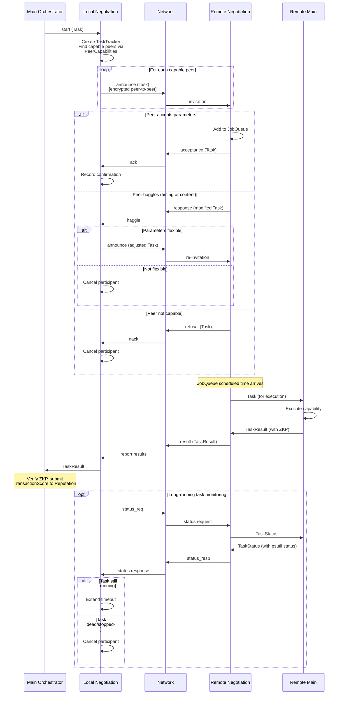

[< Identity Protocol](identity-protocol.md)

# Task Negotiation

The negotiation subsystem handles distributed task assignment, parameter haggling, execution monitoring, and result collection.

## Protocol Messages

| Message | Constant | Direction | Purpose |
|---------|----------|-----------|---------|
| `spawn task` | `start` | main -> negotiation | Local: initiate a new task |
| `invitation` | `announce` | requester -> capable peers | Invite peers to execute a task |
| `haggle` | `response` | peer -> requester | Counter-propose modified parameters |
| `task info` | `task` | -- | (reserved) |
| `ack` | `acceptance` | peer -> requester | Peer accepts the task |
| `nack` | `refusal` | peer -> requester | Peer refuses the task |
| `status request` | `status_req` | requester -> peer | Check long-running task status |
| `status response` | `status_resp` | peer -> requester | Report task execution status |
| `report results` | `result` | peer -> requester | Deliver task results |

## Task Lifecycle

## Key Components

### JobQueue

A priority queue of `Job` objects ordered by scheduled execution time. Tasks are popped when `now() >= job.when`. Duplicate tasks are limited to `max_task_duplicates` (5) to prevent spam.

### PeerCapabilities

Maps capability names to lists of peer UUIDs. When a task is started, the negotiation process looks up which peers have registered the required capability and sends invitations only to those peers.

### TaskTracker

Tracks outstanding remote tasks by UUID, storing expected results per peer. A task is complete when results from all expected participants are collected.

### Spam Protection

If a peer sends duplicate task invitations beyond `max_task_duplicates`, the peer is demoted in the hierarchy.

[Reputation Consensus >](reputation.md)
