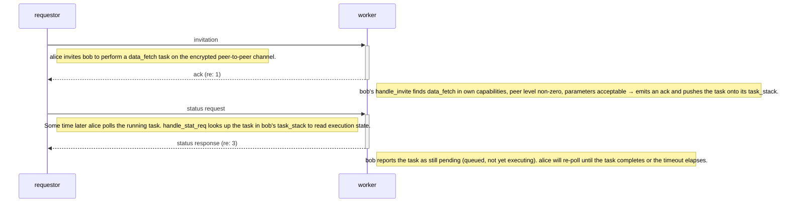

*Previous: [Becoming a peer](identity-protocol.md)*

# Getting work done

Membership is not the point. A node joins a group so that work can be shared,
and the negotiation subsystem is where sharing actually happens: somebody wants
something done, finds the peers able to do it, agrees terms with them, waits,
and collects the answer.

Calling it negotiation rather than dispatch is deliberate. A worker here is not
a subordinate. It can decline, it can counter-propose, and it can be found
unauthorized partway through and dropped. The requester has no power to compel
anything, because there is no authority for it to borrow, so every task is an
agreement between two parties who each retain a veto.

That framing produces the second thing this chapter is about. Because the worker
decides for itself whether to accept, the decision is a place where trust
becomes operational. A worker checks whether it holds the capability, whether
the requester stands high enough to ask for it, and whether the request looks
like a flood. All three are refusals the worker issues on its own judgement,
with nothing consulted outside the node.

## The task lifecycle

A task moves through a small number of states, and the messages that move it are
these.

| Message | Constant | Direction | Purpose |
|---------|----------|-----------|---------|
| `spawn task` | `start` | main to negotiation | Local: initiate a new task |
| `invitation` | `announce` | requester to capable peers | Invite peers to execute a task |
| `haggle` | `response` | peer to requester | Counter-propose modified parameters |
| `ack` | `acceptance` | peer to requester | Peer accepts the task |
| `nack` | `refusal` | peer to requester | Peer refuses the task |
| `status request` | `status_req` | requester to peer | Check a long-running task |
| `status response` | `status_resp` | peer to requester | Report execution status |
| `report results` | `result` | peer to requester | Deliver task results |

The happy path below is generated from a conformance scenario by the
documentation build, so it cannot drift from the executable corpus.

<!-- at_diagram:start protocol=negotiation scenario=negotiation-canonical -->

<!-- at_diagram:end -->

Every message above except the first travels on the encrypted peer-to-peer
channel between the requester and each worker. The initial hop, from the
orchestrator to the negotiation process, is in-process over the queue rather
than on the wire.

Fan-out works from capability rather than from a roster. A locally spawned task
arrives at the negotiation process, which registers it and sends invitations to
every peer whose registered capabilities include the one the task needs. Nobody
is invited who could not have done the work.

Several steps are part of the protocol and never appear on the wire. After
accepting, the worker pushes the task onto a priority queue ordered by scheduled
execution time. When the scheduled moment arrives it pops the task, runs the
capability, and the answer flows back out as a report. Having run the work, the
worker also submits its own half of the bilateral transaction — its claim to
have done the job, which is worth whatever the requester's score for the same
task says it was worth.

On the requester side a returned result is scored and the score goes to the
reputation process, which is where the negotiation and reputation protocols
compose end to end. Two things ride with that score. The capability that
produced it, so the reputation process can apply the capability's configured
transaction weight rather than a default of one. And the evidence channel: how
the number was arrived at, which keeps a failed proof, a failed known-answer
challenge and a task that simply came back empty distinguishable downstream
when all three are the same number.

The judgment reads the challenge from the requester's own retained record of the
task, never from anything on the reply. That is not a defensive nicety, it is
the whole property: a peer that computed the wrong answer would report the
challenge its answer *does* satisfy, so a check that trusted the reply's account
of what was asked would verify nothing at all.

The two runtimes place that scoring differently, and the difference is worth
knowing when reading either one. Python scores in its orchestrator, which is
also where it verifies any proof attached to the result. C scores in its
negotiation process, because that is where C keeps the requester's record; its
orchestrator is a router that knows nothing about capabilities, and moving the
capability and the challenge to it would have meant widening an inter-process
struct to carry a fact that was already in hand. What the conformance corpus
pins across the two is therefore the scoring rules rather than a shared call
site. C also attaches no proofs, so it always takes the arm Python takes when
proofs are unavailable: score on completion, and say so.

## Three ways to say no

A worker refuses for three distinct reasons, and the distinctions matter because
each guards something different.

Firstly, *not capable*. If the worker has not registered the requested
capability, it refuses immediately. This is bookkeeping rather than judgement,
and it catches stale capability maps rather than adversaries.

Second, *below the required tier*. The worker derives the trust tier of the
sender from reputation and refuses when that tier falls short of what the
capability requires. A capability declaring a required tier of zero admits
everyone; higher-tier capabilities gate out peers with low standing. One detail
carries the security of this check: the authoritative source of the required
tier is the *local* capability definition, never a serialized one arriving off
the wire. A requester that could name the tier its own request requires would
face no gate at all.

Third, *flood threshold*. Past five invitations carrying the same task
identifier, the worker refuses and stops processing that invitation. The counter
persists across admissions, so a peer cannot reset it by leaving and rejoining.
It counts *distinct* invitations: a replayed one is turned away earlier, by the
freshness check described below, and never reaches the counter.

Refusal is not the only alternative to acceptance. When the parameters proposed
by the worker disagree with the ones the requester sent, whether over timing or
over content, the worker haggles, sending back a counter-proposed task. The
requester then either re-announces with the adjusted parameters, if the task was
declared flexible, or cancels that participant.

## The gate holds for the life of the task

Checking the trust tier at invitation time would leave an obvious hole. A task
that runs for an hour would be authorized by standing the peer held an hour ago,
and a peer that has been demoted meanwhile would continue working under an
authorization it no longer merits.

So demotion reaches into running work. When the reputation process demotes a
peer, it emits a notification that the negotiation process handles by walking
two surfaces: the jobs this node scheduled on behalf of the demoted peer, and
the trackers for tasks this node requested from it. Any task whose capability
now requires a tier above what the peer holds is dropped.

This is the same principle the whole framework runs on, applied one level down.
Trust is a live value, so an authorization derived from trust has to be live
too, and an authorization that was correct when granted is not thereby correct
now.

## Components, and what each protects

Four pieces carry the subsystem, and each exists to bound a specific failure.

The *job queue* is a priority queue of scheduled work, ordered by execution
time, with duplicates capped. It bounds how much a single requester can commit a
worker to.

The *peer capabilities* map associates capability names with the peers that
registered them, so invitations reach only plausible workers. It bounds
invitation traffic.

The *task tracker* records outstanding remote tasks by identifier, the results
expected from each participant, and what the requester asked for — the
capability and the invocation's arguments — because a returned answer can only
be judged against the question. Once the task completes the entry is deleted,
which is what makes later results for the same task rejected rather than
accepted.

What counts as complete is one of the few places the two runtimes still
disagree: Python forwards on the first reply, C waits for every peer it
invited. For a directed probe, addressed to exactly one peer, the two coincide.
See ISSUES.md.

*Spam protection* is the flood counter described above, refusing and returning
rather than merely logging. It is canonical behavior in both the Python and C
implementations, which matters because a defense present in one runtime and
absent in the other is a defense an adversary selects around.

A re-delivered invitation is refused rather than counted. Every invitation
carries a freshness sequence — the requester's monotonic counter, stamped into
the task itself — and the worker keeps the highest it has accepted from that
requester, refusing anything at or below it. A duplicate on an unreliable
transport costs nothing, because the task was already admitted the first time,
and a deliberate replay buys nothing, because it never reaches the handler's
working parts at all.

That check runs *before* the flood counter, and the order is the security
property rather than an implementation detail. Behind the counter, replaying one
captured invitation six times would trip the flood refusal — and a refusal is
what the requester reads as the worker dropping out, which it acts on by
cancelling that participant. A replay would then be a way to evict an honest
worker from work it had already accepted. Ahead of the counter, the counter
counts what it was built to count: distinct invitations for one task, which is
a requester misbehaving rather than an attacker echoing.

An invitation carrying no sequence at all is refused too, with no lenient path
for senders that predate the field. A worker that accepted unstamped
invitations would be a worker an attacker selects by simply not stamping, and
what that buys is execution of work on somebody else's node.

## Pinned scenarios

The executable corpus that holds the behavior above. Each is a recorded trace
both runtimes must reproduce.

| Behavior | Scenario |
|---|---|
| Happy path, invite to poll | [`negotiation-canonical.yaml`](../../src/autonomous-trust/conformance/scenarios/negotiation/negotiation-canonical.yaml) |
| Spawn fan-out to capable peers | [`spawn-task-fanout.yaml`](../../src/autonomous-trust/conformance/scenarios/negotiation/spawn-task-fanout.yaml) |
| Refuse, capability not held | [`invite-refuse-not-capable.yaml`](../../src/autonomous-trust/conformance/scenarios/negotiation/invite-refuse-not-capable.yaml) |
| Refuse, below required tier | [`invite-refuse-below-required-tier.yaml`](../../src/autonomous-trust/conformance/scenarios/negotiation/invite-refuse-below-required-tier.yaml) |
| Refuse, v1 peer-level floor | [`invite-refuse-low-rep.yaml`](../../src/autonomous-trust/conformance/scenarios/negotiation/invite-refuse-low-rep.yaml) |
| Refuse, past the flood threshold | [`invite-flood-past-threshold.yaml`](../../src/autonomous-trust/conformance/scenarios/negotiation/invite-flood-past-threshold.yaml) |
| Haggle, counter-proposal | [`invite-haggle-counterprop.yaml`](../../src/autonomous-trust/conformance/scenarios/negotiation/invite-haggle-counterprop.yaml) |
| Results forwarded on completion | [`report-results-forwarded.yaml`](../../src/autonomous-trust/conformance/scenarios/negotiation/report-results-forwarded.yaml) |
| Demotion cancels running work | [`tier-loss-cancels-running-task.yaml`](../../src/autonomous-trust/conformance/scenarios/negotiation/tier-loss-cancels-running-task.yaml) |
| Invitation replay refused, worker keeps the task | [`invite-replay-survives.yaml`](../../src/autonomous-trust/conformance/scenarios/negotiation/invite-replay-survives.yaml) |
| Unstamped invitation refused | [`invite-unstamped-refused.yaml`](../../src/autonomous-trust/conformance/scenarios/negotiation/invite-unstamped-refused.yaml) |

The v1 binary floor, refusing whenever the peer level was zero, is still pinned
alongside the per-capability tier comparison that replaced it.

## Further reading

- [Standing turned into capability](trust-tiers.md): where the required tier on a
  capability comes from, and what each tier admits.
- [Earning standing](reputation.md): what happens to the transaction score the
  requester submits once the result has been verified.
- [Networking](networking.md): the peer-to-peer channel these messages travel on.
- [Integration testing](integration-testing.md): how the task lifecycle is
  exercised end to end.

---

*Next: [Earning standing](reputation.md)*
