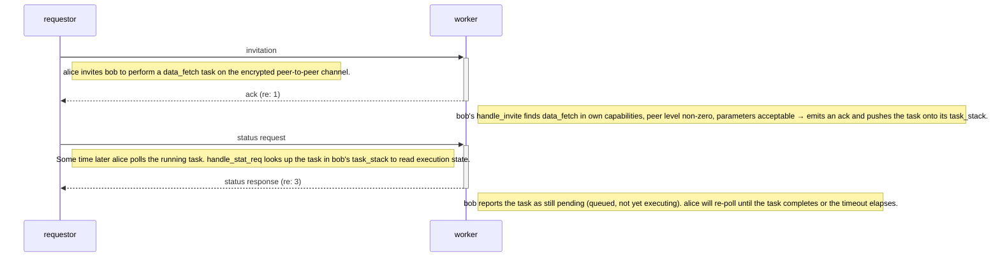

[< Identity Protocol](identity-protocol.md)

# Task Negotiation

The negotiation subsystem handles distributed task assignment, parameter haggling, execution monitoring, and result collection.

## Protocol Messages

| Message | Constant | Direction | Purpose |
|---------|----------|-----------|---------|
| `spawn task` | `start` | main -> negotiation | Local: initiate a new task |
| `invitation` | `announce` | requester -> capable peers | Invite peers to execute a task |
| `haggle` | `response` | peer -> requester | Counter-propose modified parameters |
| `task info` | `task` | -- | (reserved) |
| `ack` | `acceptance` | peer -> requester | Peer accepts the task |
| `nack` | `refusal` | peer -> requester | Peer refuses the task |
| `status request` | `status_req` | requester -> peer | Check long-running task status |
| `status response` | `status_resp` | peer -> requester | Report task execution status |
| `report results` | `result` | peer -> requester | Deliver task results |

## Task Lifecycle

The diagram below is generated from `conformance/scenarios/negotiation/negotiation-canonical.yaml` by `scripts/build-docs.sh` — it cannot drift from the executable corpus. The canonical pins the invite → ack → poll happy path; the rest of the protocol (refuse, haggle, result reporting) is documented as separate scenarios linked below.

<!-- at_diagram:start protocol=negotiation scenario=negotiation-canonical -->

<!-- at_diagram:end -->

**Channel semantics.** `invitation`, `ack`, `nack`, `haggle`, `status request`, `status response`, and `report results` all travel on the **encrypted peer-to-peer channel** between the requester and each worker. The local `spawn task` hop (Main Orchestrator → NegotiationProcess) is in-process via the IPC queue, not on the wire.

**Refuse branches** (not in the canonical, pinned by separate scenarios):

- **Not capable.** If the worker doesn't have the requested capability registered, `handle_invite` short-circuits and emits `nack`. Trace: [`invite-refuse-not-capable.yaml`](../../src/autonomous-trust/conformance/scenarios/negotiation/invite-refuse-not-capable.yaml).
- **Below required tier.** The worker derives the sender's trust tier from reputation and refuses if `sender_tier < capability.required_tier` (`handle_invite`, negprocess.py:178-179). A capability with `required_tier = 0` admits everyone; higher-tier capabilities gate out low-tier/low-reputation peers. The **local** `Capability` is the authoritative source of `required_tier` — a serialized one off the wire is not trusted. (AT v1 used a binary "peer level 0 ⇒ refuse" floor — still pinned by `invite-refuse-low-rep.yaml`; the gate is now the per-capability tier comparison.) Traces: [`invite-refuse-low-rep.yaml`](../../src/autonomous-trust/conformance/scenarios/negotiation/invite-refuse-low-rep.yaml), [`invite-refuse-below-required-tier.yaml`](../../src/autonomous-trust/conformance/scenarios/negotiation/invite-refuse-below-required-tier.yaml). See [Trust Tiers §7](trust-tiers.md).
- **Flood threshold.** Past `max_task_duplicates = 5` invites of the same task uuid, `handle_invite` emits `nack` and short-circuits (refuse-and-return). The flood counter persists across admissions (BUGS.md §P7) and is canonical AT v1 behavior on both Python and C. Trace: [`invite-flood-past-threshold.yaml`](../../src/autonomous-trust/conformance/scenarios/negotiation/invite-flood-past-threshold.yaml).

**Haggle branch.** When the worker's parameters disagree with the requester's (timing window or content), `handle_invite` emits `haggle` carrying a counter-proposed `Task`. The requester's `handle_haggle` either re-announces with the adjusted parameters (if `flexible: true`) or cancels the participant. Trace: [`invite-haggle-counterprop.yaml`](../../src/autonomous-trust/conformance/scenarios/negotiation/invite-haggle-counterprop.yaml).

**Result reporting.** When the worker completes the task, it emits `report results` carrying the `TaskResult` (and ZKP where applicable). The requester's `handle_results` records the per-peer result, forwards to the main queue when all participants have reported, then deletes the `my_tasks` entry so further results are rejected. Trace: [`report-results-forwarded.yaml`](../../src/autonomous-trust/conformance/scenarios/negotiation/report-results-forwarded.yaml).

**Spawn fan-out.** A locally-spawned task hits the negotiation process via the main → negotiation queue with `function: spawn task`. The handler registers the task in `my_tasks` and fan-outs `invitation` messages to every peer whose capabilities include the task's capability. Trace: [`spawn-task-fanout.yaml`](../../src/autonomous-trust/conformance/scenarios/negotiation/spawn-task-fanout.yaml).

**Internal steps not on the wire** (omitted from the diagram, but part of the protocol):

- After receiving `invitation` and emitting `ack`, the worker's `_add_task` pushes the task onto its `JobQueue` priority queue, ordered by scheduled execution time.
- When `now() >= job.when`, the worker pops the task and hands it to its Main Orchestrator for capability execution. The result (with ZKP) flows back into the negotiation process before being emitted as `report results`.
- The requester's Main Orchestrator submits a `TransactionScore` to the Reputation process after verifying the ZKP — that's where the Negotiation and Reputation protocols compose end-to-end.

**Tier loss and task cancellation.** When ReputationProcess demotes a peer it emits a `tier_lost` IPC, which NegotiationProcess handles in `handle_tier_lost` (negprocess.py:342). It walks two surfaces and cancels work the demoted peer is no longer authorised for: `task_stack` (jobs I scheduled to run on the peer's behalf) and `my_tasks` (trackers for tasks I requested from the peer). A task/participant is dropped when its `capability.required_tier` now exceeds the peer's new tier. This keeps the tier gate enforced for the *lifetime* of a task, not just at invite time. Trace: [`tier-loss-cancels-running-task.yaml`](../../src/autonomous-trust/conformance/scenarios/negotiation/tier-loss-cancels-running-task.yaml). See [Trust Tiers §7](trust-tiers.md).

**Replay idempotency.** Re-delivering the same `invitation` is canonical and survives: the flood counter advances but the task admission is unchanged. Trace: [`invite-replay-survives.yaml`](../../src/autonomous-trust/conformance/scenarios/negotiation/invite-replay-survives.yaml).

## Key Components

### JobQueue

A priority queue of `Job` objects ordered by scheduled execution time. Tasks are popped when `now() >= job.when`. Duplicate tasks are limited to `max_task_duplicates` (5) to prevent spam.

### PeerCapabilities

Maps capability names to lists of peer UUIDs. When a task is started, the negotiation process looks up which peers have registered the required capability and sends invitations only to those peers.

### TaskTracker

Tracks outstanding remote tasks by UUID, storing expected results per peer. A task is complete when results from all expected participants are collected.

### Spam Protection

Once a peer sends more than `max_task_duplicates` (5) duplicate invitations for the same task uuid, `handle_invite` emits `nack` and short-circuits further processing for that invite. The per-task flood counter persists across admissions (BUGS.md §P7) and is canonical AT v1 behavior on both Python and C (refuse-and-return).

[Reputation Consensus >](reputation.md)
