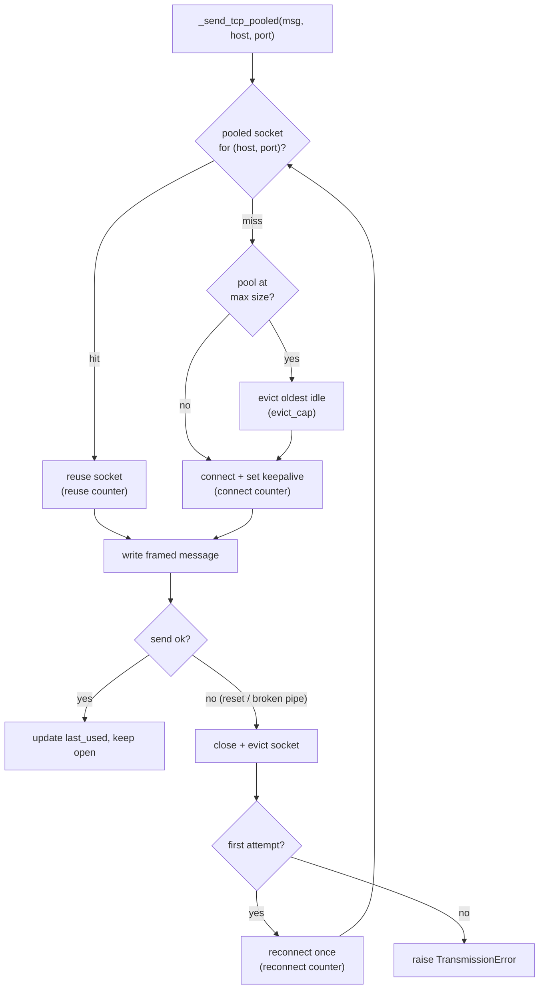

<!--
 Copyright 2026 TekFive, Inc., Sean M. Brennan, and contributors
 Licensed under the Apache License, Version 2.0.
-->
[< Networking](networking.md)

# TCP Connection Pooling

The TCP transport can reuse one connection per peer for many messages instead
of opening a fresh connection for each one. Pooling is optional and off by
default; when it is off, the transport behaves exactly as it always has, one
`connect`/`send`/`close` per message.

> This describes the Python `TCPNetworkProcess`
> (`network/tcp.py`). The C transport (`src/c/autonomous_trust/network/`) still
> connects per message. That difference is safe because pooling changes only
> the connection *lifecycle*, not the wire *format*: a pooling node and a
> per-message node interoperate on the same network (see
> [Interoperability](#interoperability)).

## Why pooling exists

Without pooling, `TCPNetworkProcess` opens a TCP connection for every
application message: `socket()`, `connect()`, send one length-prefixed frame,
`close()`. The receiver mirrors it, accepting a client socket, reading exactly
one frame, then dropping the socket. Every message therefore costs a full
handshake and teardown on both ends.

In a co-located cohort this is expensive. With dozens of processes on one host,
the handshake and per-connection setup rate tracks the message rate and burns a
continuous slice of CPU, independent of the poll cadence. Pooling reuses a
connection across many messages, so in steady state the handshake rate drops
from roughly one per message to roughly one per peer per idle period.

## Framing is unchanged

Each message is a 4-byte big-endian length prefix followed by that many bytes
of payload (`struct.pack('!I', len)` + body). A pooled connection simply
carries many of these frames back to back. `_recv` already reads exactly one
frame at a time, so a persistent reader is the same read logic called in a
loop. Because the bytes on the wire are identical either way, the conformance
corpus (which pins message bytes, not connection lifecycle) is unaffected.

## Send side: the connection pool

`TCPNetworkProcess` keeps a pool keyed by destination:

- `self._conn_pool`: a `dict` mapping `(host, port)` to a `_PooledConn`
  (the live socket plus the wall-clock time it was last used).
- `self._pool_lock`: a `threading.Lock` guarding the pool. Sends run on the
  network main loop, so the lock mainly guards the loop against the group and
  ping paths rather than heavy contention.

`_send_tcp` picks the path based on the feature flag. With pooling off it runs
the historical inline `connect`/`send`/`close`. With pooling on it calls
`_send_tcp_pooled`:

Three behaviors are worth calling out:

**Reconnect once.** A pooled socket can be half-open: the peer recycled or reset
it, but this side has not noticed yet. The first write on such a socket fails
with a socket error. The pool closes and evicts it, then reconnects and retries
exactly once. A second failure raises `TransmissionError`, which is what the
caller already handles for the per-message path.

**Keepalive.** New pooled sockets get `SO_KEEPALIVE`, plus idle, interval, and
count tuning where the platform exposes them (Linux `TCP_KEEPIDLE`,
`TCP_KEEPINTVL`, `TCP_KEEPCNT`). This lets the OS notice a dead peer on an
otherwise idle connection.

**Idle reaping.** `reap_idle_conns` runs once per main-loop iteration and
rate-limits itself. On each sweep it closes and evicts any connection idle
longer than the TTL, so the pool does not hold file descriptors open for peers
that have gone quiet. A live-connection cap bounds the pool size directly; when
a new destination would exceed it, the oldest idle connection is evicted first.

## Receive side: persistent readers

When a sender keeps its connection open and streams frames, the receiver cannot
go back to `accept` after a single read. With pooling on, `start_receivers`
launches an acceptor thread per channel instead of the accept-read-one receiver:

- The acceptor loops on `accept`. It applies the same gates as the per-message
  path, dropping its own address and blacklisted senders, and enforces the
  live-connection cap. For each surviving connection it hands the client socket
  to a reader thread.
- Each reader loops `_recv` on its socket, appending `(raw, from_addr)` to the
  same `peer_messages` (or `group_messages`) deque the main loop already
  drains. Downstream attribution and rate tracking are therefore unchanged. The
  reader exits when the peer disconnects, on a transmission error, or after the
  socket has been idle past the TTL, then closes the socket and removes itself
  from the live set.

This is the thread-per-connection model, which suits the cohort sizes seen here
(roughly ten to twenty connections per node). Its cost is one thread and one
file descriptor per live peer connection, bounded by the cap. A selector-based
single reader would scale to far more connections with O(1) threads, at the
price of per-connection read buffers to reassemble frames across partial
wakeups. That is the escape hatch if a much larger cohort ever needs it; it is
not implemented today.

## Concurrency

The send pool is guarded by one lock. Sends originate on the network main loop,
so the lock's job is to keep the group and ping paths from racing the loop, not
to arbitrate many concurrent senders. Receive readers are independent, one per
connection, each feeding a thread-safe deque, which was already the case for the
per-message receivers.

The pool lock and the reader-set lock are `threading.Lock` objects, which cannot
be pickled across the multiprocessing spawn handoff. They are therefore created
in `_init_transport`, which runs once in the worker subprocess before any
receiver thread starts, mirroring how the ping thread pool is created lazily for
the same reason. At shutdown, `close_connections` drains the send pool; reader
threads notice the stop flag and close their own sockets.

## Interoperability

Pooling changes lifecycle, not wire bytes, so a pooling node interoperates with
a per-message node in either direction:

- A pooling sender talking to a per-message receiver (for example a C node, or a
  Python node with pooling off) succeeds. The receiver reads the first frame and
  closes; the sender's next write finds a dead socket, and the reconnect-once
  logic opens a new connection. The gain is smaller against such a peer because
  it reconnects per message, but it stays correct.
- A per-message sender talking to a pooling receiver succeeds. The persistent
  reader accepts the connection, reads the single frame, and then sees a clean
  close on the next read and exits. Each message costs one short-lived reader
  thread, which is fine at these cohort sizes.

Because the two sides negotiate nothing about connection reuse, a cohort can mix
pooling and non-pooling nodes freely.

## Configuration

Pooling is controlled from `system.py`, which reads the following environment
variables at import time. All default to the safe, historical behavior.

| Setting | Env var | Default | Meaning |
|---------|---------|---------|---------|
| `net_persistent_conn` | `AT_NET_POOL` | off | Enable connection pooling and persistent readers. |
| `net_conn_idle_ttl` | `AT_NET_CONN_IDLE_TTL` | 30.0 s | Close a pooled or accepted connection after this long idle. |
| `net_max_live_conns` | `AT_NET_MAX_CONNS` | 64 | Cap on simultaneous live connections per direction. |

Rolling it out is a matter of enabling the flag on a subset of nodes, comparing
the connection-churn metrics and host CPU against the per-message baseline, and
enabling it by default once the numbers hold. The per-message path stays in
place as the fallback the flag selects.

## Metrics

When probes are enabled (`AT_PROBES`), the transport emits counters that show
whether pooling is doing its job. Reuse should dominate connects, and the accept
rate should fall well below the message rate.

| Counter | Meaning |
|---------|---------|
| `net.tcp.send/reuse` | Message sent on an existing pooled socket. |
| `net.tcp.send/connect` | New connection opened (also emitted by the per-message path). |
| `net.tcp.send/reconnect` | Pooled socket was dead; reconnected once. |
| `net.tcp.send/connect_failed` | `connect` itself failed. |
| `net.tcp.pool/evict_idle` | Connections closed by the idle reaper. |
| `net.tcp.pool/evict_cap` | Oldest connection evicted to respect the cap. |
| `net.tcp.{peer,group}/accepted` | Inbound connection accepted. |
| `net.tcp.{peer,group}/drop` | Inbound connection refused (own address, blacklist, or cap). |
| `net.tcp.reader/open`, `net.tcp.reader/close` | Persistent reader started or exited (close carries a reason). |

## Failure handling

- **Half-open or reset sockets** on the send side are caught by the
  reconnect-once retry, backed by keepalive for connections that sit idle.
- **Resource exhaustion.** Long-lived sockets widen the surface for a peer that
  tries to hold many connections open. The live-connection cap and idle TTL
  bound both directions, and the accept-time blacklist and own-address gates
  still apply before a reader thread is ever created.
- **Ordering** is preserved, since frames are sequential within a connection.

[< Networking](networking.md)
