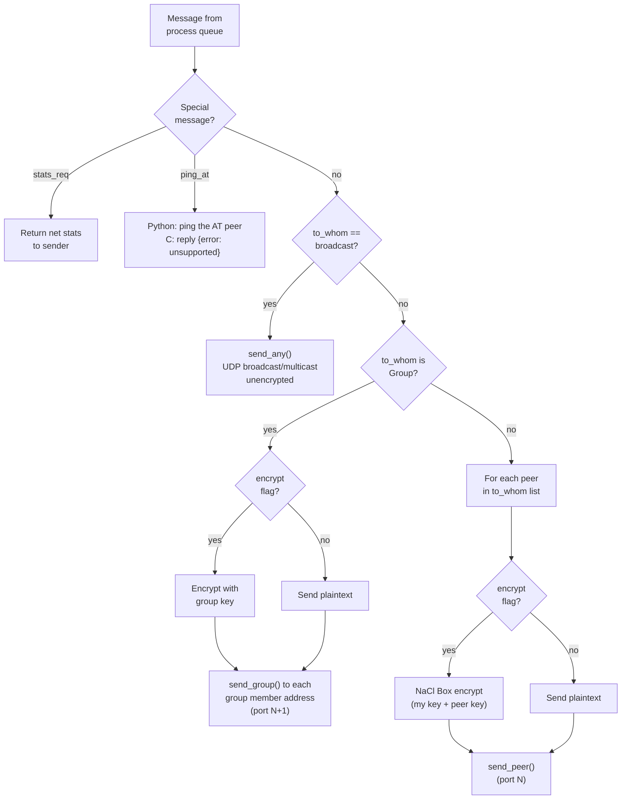

*Previous: [Node lifecycle](node-lifecycle.md)*

# Networking

The network layer handles all wire communication between nodes. It provides
three logical channels with different security properties, runs receiver threads
for concurrent I/O, and routes messages between the network and internal process
queues.

> This describes the Python `NetworkProcess`. The C implementation
> (`src/c/autonomous_trust/network/`) implements the **same wire protocol**, and
> C and Python nodes interoperate on the same network: provided both sides use
> the DRY canonical JSON wire form for identity/group payloads (see
> [Native / FFI Dual Implementation](native-ffi-dual-implementation.md) §6).

## Communication channels

| Channel | Transport | Encryption | Use Case |
|---------|-----------|------------|----------|
| **Open broadcast** | UDP broadcast or multicast | None | Identity announcements, initial discovery |
| **Encrypted group** | UDP to each group member (port N+1) | NaCl SecretBox (shared group key) | Proposals, votes, confirmations, history diffs, Paxos consensus |
| **Encrypted peer-to-peer** | UDP (or TCP) to individual peer (port N) | NaCl Box (sender private + recipient public) | History transfer, task negotiation, reputation messages |

## Socket layout

The `UDPNetworkProcess` binds three UDP sockets:

| Socket | Address | Port | Purpose |
|--------|---------|------|---------|
| `recv_ptp_sock` | Node IP | N | Peer-to-peer receive |
| `recv_grp_sock` | Node IP | N+1 | Group receive |
| `recv_cast_sock` | Broadcast/multicast addr | N | Open broadcast receive |

### Where N comes from

N is resolved once per node, from three layers in order:

1. the provisioned config's `port` (a config always wins),
2. the `AT_COMM_PORT` environment variable (operator override, applied only
 where the config is silent),
3. the compile-time default, 27787.

C: `net_port_resolve()` (`network/network.h`), logged at startup with the layer
that supplied it. Python: `system.resolve_comm_port()`. Both refuse a value that
is unparseable or outside [1024, 65534], keeping the default rather than
yielding 0, which would take an ephemeral port and leave the node where no peer
looks. The upper bound leaves room for the derived N+1. The two implementations
are held to the same table by the `network/port-resolution` conformance case.

The config generator records `port` only when the operator asked for one, so a
provisioned root does not pin every node to one port.

**Two nodes on one host** therefore need only different `AT_COMM_PORT` values,
or different addresses. Same base *and* same address now fails loudly: the
second node's peer recv socket gets `EADDRINUSE` at open, and the error names
the likely cause and the knob to move rather than reporting a bare "Address
already in use".

That is a per-socket property, not a global one. `SO_REUSEADDR` is set only
where several listeners on one addr:port is the intent, the broadcast/multicast
recv socket, and the TCP listeners, where the option grants a bind over
`TIME_WAIT` but never over a live `LISTEN`. The UDP **unicast** recv sockets
(peer, group) omit it in both runtimes, because with the option on both sockets
Linux permits a duplicate bind and delivers every datagram to the last binder,
leaving the first node deaf with nothing logged (`ISSUES.md` 2.4.2).

Python derives two further ports from the same base: `ping_at_rcv` = N+2 and
`ping_at_snd` = N+3. C has no counterpart: it implements neither. Both PingAT
sockets bind a specific address, the client derives one from the route to its
target when the caller supplies none, so co-located nodes separated only by
address do not receive each other's replies (`ISSUES.md` 2.4.3).

**PingAT is not ICMP.** It asks whether an *AT peer* is present and answering on
the ports AT itself uses, via a cooperating responder (`PingATServer`); `ping(8)` asks
whether a *host* is reachable. A host can answer ICMP with no AT process running
at all, and an AT node can be present while ICMP is filtered, so the two answer
different questions. The name says which one this is. PingAT is
non-load-bearing: a missed reply costs a latency sample and changes no AT
behaviour.

There is no NTP port. AT carries no NTP implementation on either side; a stock
daemon on the host disciplines the clock and AT only reads what it achieved (see
[Node Lifecycle](node-lifecycle.md#clock-discipline)).

The `TCPNetworkProcess` extends this by replacing peer and group UDP with TCP
(using `listen`/`accept`), while keeping UDP for broadcast/multicast. TCP uses
`[length]\|[data]` framing for reliable delivery. By default it opens one
connection per message; it can optionally reuse one connection per peer for many
messages, described in [TCP Connection Pooling](network-connection-pooling.md).

## Wire message format

Messages are serialized as pipe-delimited strings:

```
process|function|data
```

- **process.** Target subsystem name (e.g., `identity`, `negotiation`, `reputation`)
- **function.** Protocol message type (e.g., `request_access`, `invitation`, `ask permission`)
- **data.** JSON-serialized payload (Configuration objects auto-deserialize if they contain `__type__`)

For encrypted channels, the entire serialized string is encrypted before
transmission.

## Receiver threads

`NetworkProcess.process()` starts four daemon threads:

| Thread | Method | Channel | Behavior |
|--------|--------|---------|----------|
| **peer_receiver** | `peer_receiver()` | Peer socket | Appends `(raw_msg, from_addr)` to `peer_messages` |
| **group_receiver** | `group_receiver()` | Group socket | Appends to `group_messages` |
| **unknown_receiver** | `unknown_receiver()` | Broadcast socket | Appends to `unknown_messages` |
| **mystery_handler** | `mystery_handler()` |, | Retries encrypted messages from unknown peers |

The mystery handler exists because during bootstrapping, encrypted messages may
arrive before the sending identity is known. It holds these messages and retries
decryption periodically (up to 30 seconds) as peers are discovered.

## Send-side message routing

When a process places a `Message` on the network queue, `NetworkProcess` routes
it based on `message.to_whom`:



## Receive-side message processing

The main loop processes one message from each receive queue per tick:

```mermaid
flowchart TD
    subgraph "Peer Messages (peer_messages)"
        PM["Pop message"] --> NoPeers{"No peers<br/>known yet?"}
        NoPeers -- "yes" --> TryPlain["Parse as plaintext<br/>(bootstrapping)"]
        TryPlain -- "UnicodeDecodeError" --> Defer["Move to<br/>encrypted_messages<br/>(mystery handler)"]
        NoPeers -- "no" --> KnownPeer{"Sender in<br/>peer list?"}
        KnownPeer -- "yes" --> Decrypt["Decrypt with<br/>NaCl Box"]
        Decrypt -- "success" --> Route["Route to<br/>process queue"]
        Decrypt -- "fail" --> Fallback["Try plaintext<br/>fallback"]
        Fallback -- "success" --> Route
        Fallback -- "fail" --> LogErr["Log error"]
        KnownPeer -- "no" --> Ignore["Log: not a peer,<br/>ignore"]
    end

    subgraph "Group Messages (group_messages)"
        GM["Pop message"] --> HasGroup{"Group<br/>exists?"}
        HasGroup -- "no" --> Skip["Skip for now"]
        HasGroup -- "yes" --> InGroup{"Sender in<br/>group?"}
        InGroup -- "yes" --> GrpDecrypt["Decrypt with<br/>group key"]
        GrpDecrypt -- "success" --> GrpRoute["Route to<br/>process queue"]
        GrpDecrypt -- "CryptoError" --> GrpErr["Log crypto error"]
        InGroup -- "no" --> GrpIgnore["Log: not in group,<br/>ignore"]
    end

    subgraph "Unknown Messages (unknown_messages)"
        UM["Pop message"] --> Parse["Parse as plaintext<br/>(no validation)"]
        Parse --> UmRoute["Route to<br/>process queue"]
    end
```



## Queue dispatch

After decryption, `_msg_to_queue()` parses the wire format and routes the
resulting `Message` to the correct process queue:

1. Parse `raw_msg` into `Message(process, function, data)`
2. Look up `message.process` in the subsystem list
3. Place the `Message` on `queues[process]`

If the process name is not recognized, the message is logged and dropped.

## Pest tracking

Peers that send invalid encrypted messages (returning `None` from decryption but
with a known address) are tracked in a `pests` dict. After exceeding
`annoy_limit` (5) failed messages, the peer is demoted in the hierarchy.

**Network tunables.** Three operational knobs resolve from an environment
override, else the compile-time default, identically in both runtimes. They
carry no config layer, unlike the base port, these are per-node tuning rather
than provisioned identity, so `network.cfg.json` does not mention them. A value
that is unparseable or out of range is refused with a warning and the default
kept, and startup logs each knob with the layer that supplied it, so an ignored
override is distinguishable from an applied one.

| Knob | Env var | Default | Range |
|------|---------|---------|-------|
| duplicate-broadcast threshold | `AT_NET_ANNOY_LIMIT` | 5 | [1, 10000] |
| receive-poll timeout | `AT_NET_RECV_POLL_MS` | 100 ms | [1, 60000] |
| mystery-message max age | `AT_MYSTERY_MAX_AGE_SEC` | 30 s | [1, 86400] |

The poll timeout is stated in milliseconds because that is the unit the two
sides can share exactly as an integer; Python's socket layer wants seconds and
divides at the point of use. The mystery bound is wall-clock **age** on both
sides: Python counted retries until 2026-08-10, which only approximated a
duration and drifted with load, while C's retry is event-driven and could never
have counted time at all. The `network/tunables-resolution` conformance case
holds the two implementations to the same table (`ISSUES.md` 2.4.4).

---

*Next: [Connection pooling](network-connection-pooling.md)*
