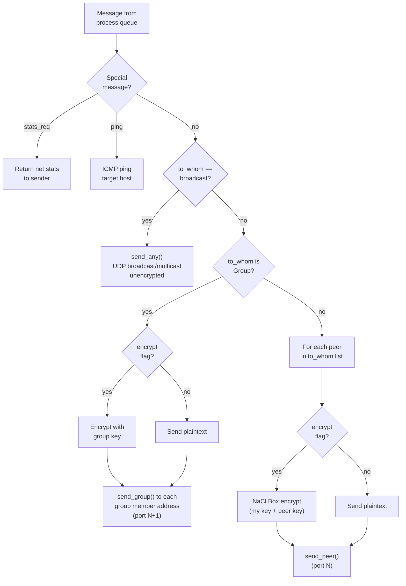

[< Process Architecture](process-architecture.md)

# Networking

The network layer handles all wire communication between nodes. It provides three logical channels with different security properties, runs receiver threads for concurrent I/O, and routes messages between the network and internal process queues.

> This describes the Python `NetworkProcess`. The C implementation
> (`src/c/autonomous_trust/network/`) implements the **same wire protocol**, and
> C and Python nodes interoperate on the same network — provided both sides use
> the DRY canonical JSON wire form for identity/group payloads (see
> [Native / FFI Dual Implementation](native-ffi-dual-implementation.md) §6).

## Communication Channels

| Channel | Transport | Encryption | Use Case |
|---------|-----------|------------|----------|
| **Open broadcast** | UDP broadcast or multicast | None | Identity announcements, initial discovery |
| **Encrypted group** | UDP to each group member (port N+1) | NaCl SecretBox (shared group key) | Proposals, votes, confirmations, history diffs, Paxos consensus |
| **Encrypted peer-to-peer** | UDP (or TCP) to individual peer (port N) | NaCl Box (sender private + recipient public) | History transfer, task negotiation, reputation messages |

## Socket Layout

The `UDPNetworkProcess` binds three UDP sockets:

| Socket | Address | Port | Purpose |
|--------|---------|------|---------|
| `recv_ptp_sock` | Node IP | N (default 27787) | Peer-to-peer receive |
| `recv_grp_sock` | Node IP | N+1 | Group receive |
| `recv_cast_sock` | Broadcast/multicast addr | N | Open broadcast receive |

The `TCPNetworkProcess` extends this by replacing peer and group UDP with TCP (using `listen`/`accept`), while keeping UDP for broadcast/multicast. TCP uses `[length]\|[data]` framing for reliable delivery.

## Wire Message Format

Messages are serialized as pipe-delimited strings:

```
process|function|data
```

- **process**: Target subsystem name (e.g., `identity`, `negotiation`, `reputation`)
- **function**: Protocol message type (e.g., `request_access`, `invitation`, `ask permission`)
- **data**: JSON-serialized payload (Configuration objects auto-deserialize if they contain `__type__`)

For encrypted channels, the entire serialized string is encrypted before transmission.

## Receiver Threads

`NetworkProcess.process()` starts four daemon threads:

| Thread | Method | Channel | Behavior |
|--------|--------|---------|----------|
| **peer_receiver** | `peer_receiver()` | Peer socket | Appends `(raw_msg, from_addr)` to `peer_messages` |
| **group_receiver** | `group_receiver()` | Group socket | Appends to `group_messages` |
| **unknown_receiver** | `unknown_receiver()` | Broadcast socket | Appends to `unknown_messages` |
| **mystery_handler** | `mystery_handler()` | -- | Retries encrypted messages from unknown peers |

The mystery handler exists because during bootstrapping, encrypted messages may arrive before the sender's identity is known. It holds these messages and retries decryption periodically (up to 30 seconds) as peers are discovered.

## Send-Side Message Routing

When a process places a `Message` on the network queue, `NetworkProcess` routes it based on `message.to_whom`:



## Receive-Side Message Processing

The main loop processes one message from each receive queue per tick:

```mermaid
flowchart TD
    subgraph "Peer Messages (peer_messages)"
        PM["Pop message"] --> NoPeers{"No peers<br/>known yet?"}
        NoPeers -- "yes" --> TryPlain["Parse as plaintext<br/>(bootstrapping)"]
        TryPlain -- "UnicodeDecodeError" --> Defer["Move to<br/>encrypted_messages<br/>(mystery handler)"]
        NoPeers -- "no" --> KnownPeer{"Sender in<br/>peer list?"}
        KnownPeer -- "yes" --> Decrypt["Decrypt with<br/>NaCl Box"]
        Decrypt -- "success" --> Route["Route to<br/>process queue"]
        Decrypt -- "fail" --> Fallback["Try plaintext<br/>fallback"]
        Fallback -- "success" --> Route
        Fallback -- "fail" --> LogErr["Log error"]
        KnownPeer -- "no" --> Ignore["Log: not a peer,<br/>ignore"]
    end

    subgraph "Group Messages (group_messages)"
        GM["Pop message"] --> HasGroup{"Group<br/>exists?"}
        HasGroup -- "no" --> Skip["Skip for now"]
        HasGroup -- "yes" --> InGroup{"Sender in<br/>group?"}
        InGroup -- "yes" --> GrpDecrypt["Decrypt with<br/>group key"]
        GrpDecrypt -- "success" --> GrpRoute["Route to<br/>process queue"]
        GrpDecrypt -- "CryptoError" --> GrpErr["Log crypto error"]
        InGroup -- "no" --> GrpIgnore["Log: not in group,<br/>ignore"]
    end

    subgraph "Unknown Messages (unknown_messages)"
        UM["Pop message"] --> Parse["Parse as plaintext<br/>(no validation)"]
        Parse --> UmRoute["Route to<br/>process queue"]
    end
```



## Queue Dispatch

After decryption, `_msg_to_queue()` parses the wire format and routes the resulting `Message` to the correct process queue:

1. Parse `raw_msg` into `Message(process, function, data)`
2. Look up `message.process` in the subsystem list
3. Place the `Message` on `queues[process]`

If the process name is not recognized, the message is logged and dropped.

## Pest Tracking

Peers that send invalid encrypted messages (returning `None` from decryption but with a known address) are tracked in a `pests` dict. After exceeding `annoy_limit` (5) failed messages, the peer is demoted in the hierarchy.

[Identity Protocol >](identity-protocol.md)
