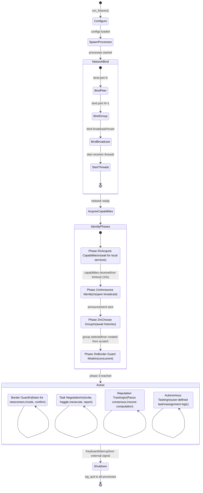

[< Reputation Consensus](reputation.md)

# Node Lifecycle

## Startup Sequence

When `AutonomousTrust.run_forever()` is called, the node goes through a deterministic startup sequence before entering its active state.

1. **Configure**: Load configuration files from `$AUTONOMOUS_TRUST_ROOT/etc/at/`. Required configs: network, identity, peers, capabilities. The `ProcessTracker` reads `subsystems.cfg.json` to determine which process classes to instantiate.

2. **Spawn processes**: The orchestrator creates a process pool and starts each subsystem process (`NetworkProcess`, `IdentityProcess`, `NegotiationProcess`, `ReputationProcess`) as an async worker, each with access to the shared queue dict.

3. **Network bind**: `NetworkProcess` binds its sockets (peer on port N, group on port N+1, broadcast) and starts four receiver threads.

4. **Identity announce**: `IdentityProcess` runs through phases 0-2 (acquire capabilities, broadcast announcement, choose group).

5. **Group join**: The node either joins an existing group (receiving history from a border guard) or creates its own.

6. **Active**: All subsystems run concurrently. The orchestrator enters `autonomous_loop`.

## State Diagram

## Active State

In the active state, four activities run concurrently:

- **Border guard** (Identity): Continuously listens on the open broadcast channel for new peer announcements, initiates voting, and manages group membership changes.
- **Task negotiation** (Negotiation): Processes incoming task invitations, manages the job queue, handles haggling, and forwards results.
- **Reputation tracking** (Reputation): Runs Paxos rounds for new transaction scores, responds to reputation queries, and synchronizes history with peers.
- **Autonomous tasking** (Main): User-defined logic in `autonomous_tasking()` that assigns tasks to peers based on capabilities and reputation.

## Process Monitoring

The orchestrator monitors subprocess health each tick via `_monitor_processes()`. If a process terminates unexpectedly (its `AsyncResult` becomes ready), the exception is logged and the process name is added to `_stopped_procs` to prevent repeated error logging.
