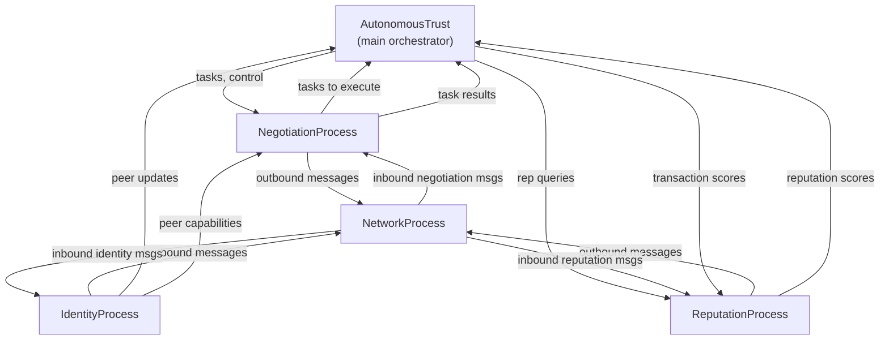

*Previous: [Trust as a live value](../concept.md)*

# How a node is built

A node is four cooperating processes and a shared set of queues. One process
talks to the network, one handles identity and group membership, one negotiates
work, and one scores conduct. They do not share memory, do not call into each
other, and communicate only by placing messages on each other's queues. An
orchestrator above them spawns the four, watches them, and runs whatever the
hosting application actually wanted done.

That decomposition is the whole architecture, and it is deliberately boring. The
interesting properties of the framework are not in any of the four processes.
The interesting properties come from the fact that each of them makes its
decisions locally, from what it has observed, without consulting anything
outside the node.

This chapter covers the shape of a node from the outside in: the four design
principles that constrain everything else, the cryptography underneath, the four
processes and how they talk, the two interoperable implementations of the same
runtime, and the deterministic sequence a node runs through between power-on and
useful work.

## Four design principles

Everything below follows from four commitments, and each one closes off a design
that would otherwise be easier.

Firstly, *zero trust as a foundation*. Every peer starts untrusted. Trust is
earned through consensus-based identity verification and maintained through
reputation scoring, so there is no state in which a peer is simply trusted
because of who it is.

Second, *consensus-based admission*. A new peer is admitted only after existing
group members vote to accept it, through a pluggable agreement protocol. No
single node can admit anyone, which is what keeps the admission gate from being
a single point of capture.

Third, *encrypted messaging throughout*. All peer-to-peer and group
communication is encrypted. Exactly one message type travels in the open, being
the initial identity announcement, and it travels in the open because a node
that has not yet joined a group holds neither the group key nor anybody's public
key.

Lastly, *decentralization without exception*. There is no central authority.
Groups form organically, reputation is maintained by leaderless Byzantine
Multi-Paxos, and tasks are negotiated directly between peers. Nothing in the
system has a privileged view, which is the property that makes the whole thing
survive a partition.

## The cryptographic floor

All cryptographic operations use NaCl and libsodium primitives, chosen for
having few knobs and no bad configurations.

| Operation | Algorithm | Purpose |
|-----------|-----------|---------|
| Signing | Ed25519 | Identity verification, vote signatures, message authentication |
| Encryption | X25519 with XSalsa20-Poly1305, the NaCl box | Peer-to-peer encrypted channels |
| Group encryption | Shared symmetric key, the NaCl secret box | Group broadcast encryption |

One principle governs the whole of it. Private keys are never transmitted on the
wire. An identity announcement contains only the public signing key and the
public encryption key, and peer-to-peer encryption combines the private key of
the sender with the public key of the recipient, so no secret ever needs to
move.

## Four processes and a queue dict

The orchestrator class spawns a pool of processes, each running in its own
operating system process, or in a thread where that is configured. Each gets a
named queue in a shared dictionary, and the orchestrator holds one of its own.

| Process | Depends on | Purpose |
|---------|------------|---------|
| Network | nothing | Send and receive messages over UDP and TCP sockets |
| Identity | network | Peer discovery, group formation, voting |
| Negotiation | network, identity | Task distribution and haggling |
| Reputation | network, identity, negotiation | Consensus-based trust scoring |

Processes self-register through a metaclass, each declaring its own name and
description, and a tracker reads a configuration file to decide which classes to
instantiate and in what order, respecting the dependency declarations above.
Further workers can be added at runtime by the hosting application. One such
worker ships with the framework, driving the bootstrap capability exchanges that
let a freshly admitted peer accumulate a transaction history rather than sitting
at flat neutral reputation.

Routing between the processes follows three rules. Outbound traffic is any
process placing a message on the network queue with a field naming the
recipients. Inbound traffic is the network process parsing wire data into
messages and routing each to the queue named in the message itself. And
inter-process traffic is one process placing an object directly on the queue of
another, as when a transaction score goes to reputation or a set of peer
capabilities goes to negotiation.



The main loop of the orchestrator cycles through four duties on every tick:
monitoring the health of the subprocesses, handling messages from its own queue,
collecting task results, and running whatever tasking logic the application
supplied. If a subprocess terminates unexpectedly, the exception is logged and
the process is recorded as stopped so the failure is reported once rather than
every tick.

## Two implementations of one runtime

The core ships twice. There is a pure Python implementation and a C
implementation, built as a shared library and bridged through a foreign function
interface, and the two interoperate on the wire. A backend is selected at import
time by an environment variable, so a C node and a Python node in the same
cohort are indistinguishable to each other.

The process model above is retained under both. C functions are called from
inside the Python subsystem processes through the bridge rather than by a
C-driven process tree, which keeps one orchestration story rather than two. The
embedded target is the exception: a standalone C daemon runs on devices with no
Python at all, which is what makes a microdrone-class node possible.

Having two implementations of one protocol is expensive, and it buys two things
that are hard to get otherwise. The C core is amenable to formal verification in
a way the Python core is not, and a conformance corpus that both must satisfy
turns every protocol ambiguity into a test failure rather than a field incident.

The framework is organized as four Python namespace packages, with the core
carrying the four subsystem processes, the configuration system, the
cryptographic primitives, and the data structures.

```
autonomous-trust (core)
  +-- autonomous-trust-services
        +-- autonomous-trust-inspector
              +-- autonomous-trust-simulator
```

## From power-on to useful work

Startup is a deterministic sequence, and it is worth walking because several
later chapters refer back to particular stages of it.

Firstly, the *clock gate*. The node reads what the host clock discipline has
achieved and declines to run on a clock nothing is steering. Timestamps order
events across a cohort, so a node with an undisciplined clock corrupts every
comparison it takes part in. The framework carries no time daemon of its own and
deliberately does not try to be one: a stock daemon on the host does the
steering, and the node reads the result through an unprivileged system call that
is honest inside a container. The gate is enforcing in shipped images and
advisory otherwise, and the log line always names which mode applied, so a start
that proceeded is never ambiguous about whether the clock was checked.

Second, *configuration*. Configuration files load from the framework root, and
the process tracker reads the subsystem list to decide what to instantiate.

Third, *process spawn*. The orchestrator creates the pool and starts each
subsystem as an async worker with access to the shared queues.

Fourth, *network bind*. The network process binds its sockets, being a peer
port, a group port above it, and a broadcast socket, and starts its receiver
threads.

Fifth, *identity announcement*. The identity process runs its opening phases,
acquiring local capabilities, broadcasting an announcement in the open, and
waiting to hear from existing groups.

Sixth, *group join*. The node either joins an existing group, receiving the
group key and history from a border guard, or creates a group of its own when
nobody answered.

Lastly, *active*. All four subsystems run concurrently and the orchestrator
enters its main loop.

In the active state four activities run at once. The identity process stands
border guard, listening for newcomers and running admission votes. The
negotiation process handles task invitations, the job queue, and results. The
reputation process runs consensus rounds and answers score queries. And the
application layer runs whatever autonomous tasking it was written to run.

Two backstops run alongside them, both of which exist because admission over
unreliable transport is not assumed to be lossless. The bootstrap worker drives
the small bilateral exchanges that warm up the transaction history of a newly
admitted peer. And periodic resync sweeps in the identity process backfill
capabilities for peers admitted without them and identities for group addresses
whose peer object never arrived.

## Further reading

- [Process architecture](process-architecture.md) and
  [node lifecycle](node-lifecycle.md): the full detail behind the two sections
  above, including the state diagram and the clock gate table.
- [Networking](networking.md) and [connection pooling](network-connection-pooling.md):
  the channel model, message routing, and optional persistent connections.
- [The dual implementation](native-ffi-dual-implementation.md): the C runtime,
  the bridge, cross-runtime serialization, and the embedded target.
- [Partition recovery](partition-recovery.md): what the resync sweeps are the
  third layer of.

---

*Next: [Becoming a peer](identity-protocol.md)*
