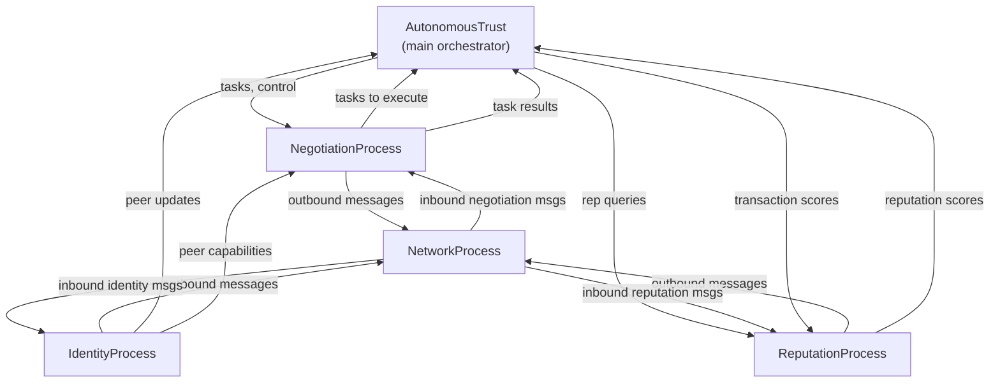

*Previous: [Infrastructure independence](../../../../doc/decentralization_momentum_alt.md)*

# Process Architecture

## Orchestrator

The `AutonomousTrust` class (in `core/automate.py`) is the main orchestrator. It
spawns a pool of `Process` subclasses, each running in its own OS process (or
thread, configurable), communicating via `multiprocessing.Queue`.

> **Applies to both backends.** This Python `multiprocessing.Queue` process
> model is retained even when the native (C/CFFI) backend is selected: C
> functions are called *within* these Python subsystem processes via CFFI, not
> by a C-driven process tree. The standalone C daemon (`run_autonomous_trust()`,
> wrapped by `NativeAutonomousTrust`) is a separate runtime used by the embedded
> build. See [Native / FFI Dual Implementation](native-ffi-dual-implementation.md).

The orchestrator itself extends `Protocol`, giving it message-handling
capabilities for task results, reputation responses, and external control
commands.

## Core processes

Four subsystem processes are registered via `ProcessTracker` and listed in
`subsystems.cfg.json`:

| Process | CfgId | Dependencies | Purpose |
|---------|-------|-------------|---------|
| `NetworkProcess` | `network` | none | Send/receive messages over UDP/TCP sockets |
| `IdentityProcess` | `identity` | network | Peer discovery, group formation, voting |
| `NegotiationProcess` | `negotiation` | network, identity | Task distribution and haggling |
| `ReputationProcess` | `reputation` | network, identity, negotiation | Paxos-based trust scoring |

## Process plugin system

Processes self-register via the `ProcMeta` metaclass. Each `Process` subclass
declares its `proc_name` and `description` in the metaclass arguments. The
`ProcessTracker` reads `subsystems.cfg.json` to determine which process classes
to instantiate and in what order (respecting dependency declarations).

Additional worker processes can be added at runtime via
`AutonomousTrust.add_worker()`. One such worker is the **`BootstrapWorker`**
(`core/_python/bootstrap_worker.py`), auto-registered to run the
bootstrap-capability corpus that lets freshly-admitted peers accumulate a
baby-steps transaction history. See [Trust Tiers §6](trust-tiers.md) and [Node
Lifecycle](node-lifecycle.md).

## IPC and queue routing

Each process gets a named queue in a shared `queues` dict. The orchestrator
creates one queue per process plus one for itself (`main`). Messages are routed
by process name:

- **Outbound (to network).** Any process places a `Message` on the `network` queue with a `to_whom` field indicating the recipient(s).
- **Inbound (from network).** `NetworkProcess` parses incoming wire data into `Message` objects and routes them to the appropriate process queue based on `message.process`.
- **Inter-process.** Processes can place objects directly on another process's queue (e.g., `TransactionScore` to the reputation queue, `PeerCapabilities` to negotiation).

The orchestrator's main loop (`autonomous_loop`) cycles through: monitoring
subprocess health, handling messages from its own queue, collecting task
results, and running user-defined tasking logic.

## Process relationships

## Starting a subsystem, and why the child must never return

A subsystem runner (`identity_run`, `net_process_run`, …) calls `process_setup`,
which calls `daemonize`, which **forks**. The runner therefore returns *in both
processes*: the daemon receives the new subsystem's pid, and the subsystem
receives its own run loop's return value — which happens at shutdown.

**A forked subsystem must `_exit`, never return.** When the six C runners all
returned instead, each subsystem resumed the daemon's start-every-subsystem loop
*inside its own process* at shutdown, walking `map_entries_for_each` over the
registry and forking a fresh generation on the way out. The symptom was survivors
after a clean stop, with pids higher than anything registered — not because the
wrong pid was recorded, but because they were forked *during shutdown by the
exiting subsystems*. Fixed 2026-08-06; a clean shutdown now logs no
`did not exit; sending SIGKILL` at all.

`daemonize` reports the **grandchild** back through its pipe, which is what the
pipe is for, so the tracker holds the real workers rather than an intermediate.
Pinned by `src/c/test/process_child_exit_test.c`.

## Collaborators travel as one context

The recurring `{procs, procs_lock, queues, logger}` collaborators are bundled
into a single `proc_context_t` (`processes.h`) rather than threaded individually:
`restart_process` takes 3 parameters instead of 6, `start_process` 5 instead of 8.

---

*Next: [Node lifecycle](node-lifecycle.md)*
