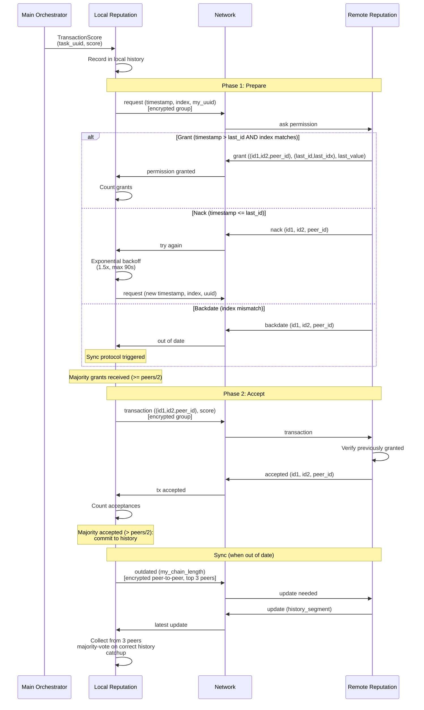

[< Task Negotiation](negotiation.md)

# Reputation Consensus

The reputation subsystem uses a leaderless Byzantine Multi-Paxos protocol to reach consensus on transaction scores across all peers. It builds on the assumption that the Identity protocol has already succeeded (permissioned consensus).

## Protocol Messages

| Message | Constant | Direction | Purpose |
|---------|----------|-----------|---------|
| `ask permission` | `request` | proposer -> group | Phase 1: request the floor with a unique proposal ID |
| `permission granted` | `grant` | peer -> proposer | Phase 1: grant with last-seen ID + chain length |
| `try again` | `nack` | peer -> proposer | Phase 1: reject (timestamp too old) |
| `out of date` | `backdate` | peer -> proposer | Phase 1: proposer's index is behind |
| `transaction` | `transaction` | proposer -> group | Phase 2: propose transaction score |
| `tx accepted` | `accepted` | peer -> proposer | Phase 2: accept the proposed transaction |
| `update needed` | `outdated` | behind-peer -> top-n peers | Sync: request missing history |
| `latest update` | `update` | peer -> behind-peer | Sync: send history segment |
| `request reputation` | `rep_req` | any process -> reputation | Query: compute a peer's score |
| `reputation response` | `rep_resp` | reputation -> requester | Query: return computed score |

## Proposal ID

Each Paxos round uses a unique proposal ID composed of:

- `id1`: Timestamp in milliseconds (`int(now().timestamp() * 1000)`)
- `id2`: Chain index (`len(history) + 1`)
- `peer_id`: Proposer's UUID

These are combined into a float index: `id1 + (id2 / 10^len(str(id2)))` for tracking.

## Paxos Consensus Flow

## Reputation Computation

When a reputation query arrives (`rep_req`), the score is computed using one of two strategies based on the peer's current standing:

### Cooperation Mode (prior score > 0.5)

Pure reputation: weighted average of all transaction scores involving this peer, where each score is weighted by the scoring peer's own reputation.

### Tit-for-Tat Mode (prior score <= 0.5)

Contrite Tit-for-Tat: examines the bilateral transaction history between the local node and the queried peer.

- If the peer defected (score < 0.5) but local standing is poor: cooperate (score >= 0.51)
- If the peer defected and local standing is fine: defect (score <= 0.49)
- Otherwise: cooperate

This encourages mutual recovery from low-trust situations while punishing sustained defection.

## Expiration

Pending requests and proposals expire after 300 seconds to prevent unbounded memory growth.

[Node Lifecycle >](node-lifecycle.md)
