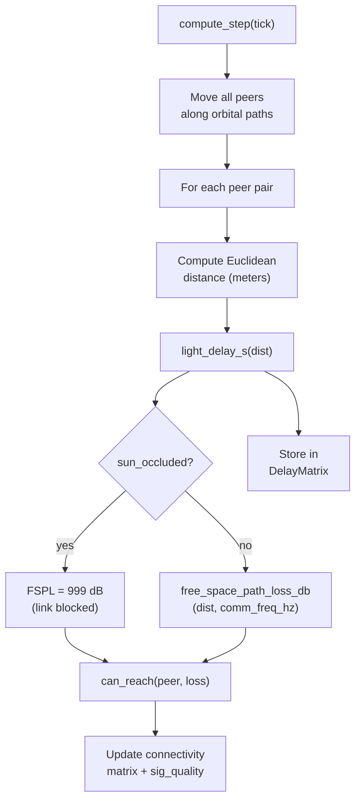

*Previous: [A compromise, detected](sg2-detection-walkthrough.md)*

# Space Communications

The space communications layer extends the terrestrial simulator to model
inter-habitat mesh networking at asteroid-belt scale. It introduces
space-specific link physics, light-time delay injection, and sun occultation
checks while reusing the existing radio, path, and peer infrastructure without
modification to the core AT protocol stack.

## Design decisions

The simulator already represents peer positions as `UTMPosition` and computes
pairwise Euclidean distance within a single UTM zone. Space mode exploits this
by placing all habitats in a dummy zone (`1N`) where easting and northing
represent heliocentric x/y coordinates in meters. No changes to the position or
distance logic are required: AU-scale meter values work correctly in the
existing same-zone Euclidean path.

Orbital motion reuses `EllipseData` / `EllipsePath` with the Sun at the ellipse
center. Kepler's third law sets the loop count so each habitat completes the
correct number of orbits over the simulation duration.

## Space interface types

Two new `NetInterface` variants and two new `Antenna` variants model
space-appropriate link budgets.

| Interface | Rate | Sensitivity | iptables Mark | Use Case |
|-----------|------|-------------|---------------|----------|
| `LASER_COMMS` | 10 Mbps | -40 dBm | 44 | Optical point-to-point, requires line-of-sight |
| `DEEP_SPACE` | 100 Kbps | -150 dBm | 55 | DSN-class RF, high-gain parabolic dish |

| Antenna | Gain (dBi) | Description |
|---------|------------|-------------|
| `LASER` | 50 | Optical telescope transmitter |
| `HIGH_GAIN_PARABOLIC` | 45 | 3-5 m DSN-class dish |

Existing terrestrial interfaces (`SMALL`, `MEDIUM`, `LARGE`) and antennas
(`DIPOLE`, `YAGI`, `PARABOLIC`) are unchanged.

## Space link physics

Three pure functions in `radio/space_link.py` provide the physics model. All
operate in SI units with no side effects.

- **Light delay.** `delay = distance / c`. At 1 AU this is approximately 499 seconds; belt-scale inter-habitat distances produce 16-64 minute one-way delays.
- **Free-space path loss.** `FSPL = 20*log10(d) + 20*log10(f) - 147.55 dB`. At X-band (8.4 GHz) and 2 AU separation, FSPL exceeds 280 dB.
- **Sun occultation.** Projects the Sun's center onto the line segment between two habitats. If the closest point on the segment falls within the solar radius (696,340 km), the link is blocked.

## Space-mode computation flow

When `SimConfig.space_mode` is true, `Simulator.compute_step` replaces the
static terrain path-loss lookup with dynamic per-pair physics.

The return tuple grows from six to seven elements, adding `DelayMatrix`.
Downstream consumers use `SimState` objects (not raw tuples), so the change is
transparent to the Dash UI and protocol layers.

## DelayRouter

`DelayRouter` extends the existing `Router` class to inject per-peer-pair
latency via Linux `tc netem`. After the parent applies iptables connectivity and
tc CBQ bandwidth rules, DelayRouter adds a netem qdisc with the computed
light-time delay.

Key properties:

- **Change detection.** Only issues `tc` syscalls when a delay value differs from the previously applied value, avoiding redundant kernel calls during steady-state orbital segments.
- **Lifecycle.** Adds the netem qdisc on first use, changes it on subsequent updates, and removes it in `finish()` before parent cleanup.
- **Receive hook.** Overrides `recv_data()` to call `apply_delays()` after every state update from the simulator.

## Asteroid belt scenario

The reference scenario places seven habitats on Keplerian solar orbits in the
main asteroid belt (2.0-3.5 AU).

| Habitat | Semi-major (AU) | Eccentricity | Interface | Antenna |
|---------|-----------------|--------------|-----------|---------|
| Ceres Station | 2.77 | 0.076 | LASER_COMMS | LASER |
| Vesta Colony | 2.36 | 0.089 | LASER_COMMS | LASER |
| Pallas Outpost | 2.77 | 0.231 | DEEP_SPACE | HIGH_GAIN_PARABOLIC |
| Hygiea Hab | 3.14 | 0.117 | DEEP_SPACE | HIGH_GAIN_PARABOLIC |
| Juno Relay | 2.67 | 0.256 | LASER_COMMS | LASER |
| Davida Mining | 3.17 | 0.187 | DEEP_SPACE | HIGH_GAIN_PARABOLIC |
| Europa Far | 2.09 | 0.101 | LASER_COMMS | LASER |

The default communication frequency is 8.4 GHz (X-band). The scenario generates
a `SimConfig` with `space_mode=True`, the Sun at the coordinate origin, and
deterministic UUIDs and IP addresses derived from habitat names. Simulation
duration defaults to 15 years to capture differential orbital motion across the
full range of relative geometries.

## Implications for AT protocols

Space-scale RTT (32-128 minutes round-trip) exceeds every timeout in the current
AT protocol stack. Identity challenge-response, negotiation haggle rounds, and
reputation voting rounds all assume sub-second RTT. Adapting these protocols
requires parameterizing timeouts as a function of expected RTT and, for
intermittent connectivity windows, a store-and-forward DTN bundle layer wrapping
the Network process. These adaptations are catalogued in [protocol timeouts at
deep-space latency](../../../../docs/space-protocol-timeouts.md), and are future
work.

---

*Next: [Delay-tolerant networking](../dtn.md)*
